<!-- START doctoc generated TOC please keep comment here to allow auto update -->
<!-- DON'T EDIT THIS SECTION, INSTEAD RE-RUN doctoc TO UPDATE -->
**Table of Contents**  *generated with [DocToc](https://github.com/thlorenz/doctoc)*

- [Ruby on Rails 6: Getting Started](#ruby-on-rails-6-getting-started)
  - [Setting Up a Rails Application](#setting-up-a-rails-application)
    - [Creating Your First Rails App](#creating-your-first-rails-app)
      - [Bundler](#bundler)
    - [Adding Features with Scaffolds](#adding-features-with-scaffolds)
    - [Creating a Basic Static Page](#creating-a-basic-static-page)
      - [About Page](#about-page)
      - [Link to About Page from Index](#link-to-about-page-from-index)
  - [Populating Pages in Rails](#populating-pages-in-rails)
    - [Creating New Paths with Routes](#creating-new-paths-with-routes)
      - [Wiki Posts Model](#wiki-posts-model)
      - [Rails Controller Actions](#rails-controller-actions)
    - [Customizing Basic CSS](#customizing-basic-css)
    - [Implementing JavaScript](#implementing-javascript)
    - [Summary](#summary)
  - [Building Dynamic Web Apps with MVC's](#building-dynamic-web-apps-with-mvcs)
    - [Working with ActiveStorage](#working-with-activestorage)
      - [Create and Edit Posts](#create-and-edit-posts)
      - [Using form_with](#using-form_with)
      - [Add Image Upload](#add-image-upload)
    - [Migrating Databases](#migrating-databases)
    - [Moving Data Between Views and Controllers](#moving-data-between-views-and-controllers)
      - [Flash System](#flash-system)
      - [Instance Variables](#instance-variables)
    - [Finishing Touches](#finishing-touches)
      - [Instance Methods](#instance-methods)
      - [Date Format](#date-format)
      - [Keeping Data in its Place](#keeping-data-in-its-place)
      - [Partials](#partials)

<!-- END doctoc generated TOC please keep comment here to allow auto update -->

# Ruby on Rails 6: Getting Started

My notes from Pluralsight [course](https://app.pluralsight.com/library/courses/getting-started-ruby-rails/table-of-contents).

## Setting Up a Rails Application

### Creating Your First Rails App

Create a Wiki in Rails. User can submit, edit, and delete posts.

Versions used in course, some outdated but stick to these for consistency:

* Ruby 2.5.0 -> too many problems, use 2.7.2 instead!
* Rails 6.1.4
* Node.js 12
* NPM 7

```bash
# Set node version instructor is using
touch .nvmrc
echo "12.18.1" > .nvmrc

# Node 12 ships with npm 6.x so explicitly install npm 7.x
npm install npm@7.24.2 -g

# Set slightly updated Ruby version from what instructor is using
rbenv install 2.7.2
rbenv local 2.7.2

# Install version of Rails CLI instructor is using
gem install rails -v 6.1.4
```

Instructor's [repo](https://github.com/XFactor-Consultants/Ruby-Getting-Started)

**MVC**

Pattern of organizing a web application's architecture:

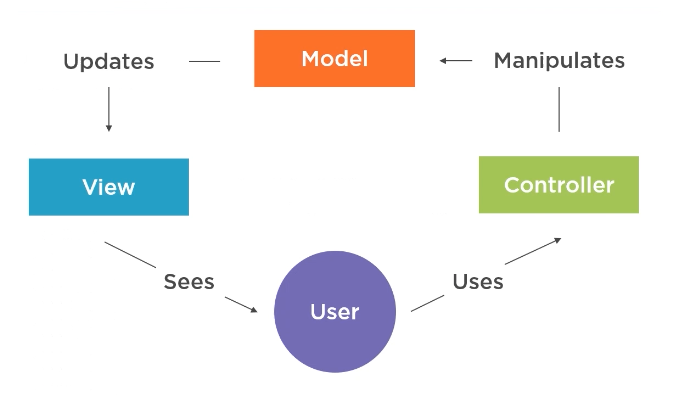

Model: Resources user of web application would like to access

Controller: Associated with model, handle all back end functionality

View: Controller serves views to show Model to user in a user-friendly page

Business logic is grouped by resources and separated by its purpose. When looking at an MVC code base to understand what it does, look at:

* Views to see how resource is rendered to user
* Models to see how data is stored
* Controller to see how business logic wrt resource works

Rails is more opinionated than other MVC frameworks.

Scaffold a new app:

```bash
rails new wiki
```

#### Bundler

Part of `rails new...` scaffold is to run bundler.

* Not part of Rails or Ruby
* Package manager that handles gems (similar to npm, yarn, pip, etc.)
* Gems are standard ruby libraries
* Ruby itself doesn't have a library system, but allows you to import other files
* Bundler and gems make importing easier and consistent
* Bundler comes with Rails by default
* When Bundler started, gems listed in `Gemfile` are automatically installed
* No need to distribute licensed Gems with a project
* Sometimes gems require other gems - dependency tree, bundler installs all of these

When `rails new project`, also runs webpacker (will discuss more later), it's for front end development.

webpacker uses `yarn`:

```
run yarn add @rails/webpacker@5.4.0...
```

Yarn is JavaScript package manager, similar to npm, used to install all the front end JavaScript dependencies.

Start server, `s` is short for `serve`.

```
bin/rails s
```

This tells the OS to execute the Rails binary that was installed in this project by bundler.

This starts the development server. Has *hot reloading* - can make changes to front or back end, refresh browser and see changes - no need to reboot server.

Rails default hello world page available at `http://localhost:3000`

### Adding Features with Scaffolds

Note the views files, eg: `wiki/app/views/layouts/application.html.erb`

```ruby
<!DOCTYPE html>
<html>
  <head>
    <title>Wiki</title>
    <meta name="viewport" content="width=device-width,initial-scale=1">
    <%= csrf_meta_tags %>
    <%= csp_meta_tag %>

    <%= stylesheet_link_tag 'application', media: 'all', 'data-turbolinks-track': 'reload' %>
    <%= javascript_pack_tag 'application', 'data-turbolinks-track': 'reload' %>
  </head>

  <body>
    <%= yield %>
  </body>
</html>
```

`.html.erb` extension is an html template file with support for Ruby logic.

erb: Embedded Ruby

Following symbol means what follows is Ruby syntax rather than html:

`<%= some_expression %>`

This doesn't get sent to browser directly. Rather, a compiler library `haml` takes the erb template and checks for any Ruby tags, then evaluates and executes that code. Whatever is returned from that gets written to the final html file sent to browser/client.

` <%= yield %>` tells Ruby that to put into the page, whatever the current controller has. This supports template inheritance and wrapping views inside other views.

If we make a change to the application template at this point, eg: replace yield with some h1 text, refresh browser, nothing changes!

```ruby
<body>
  <h1>Hello Rails Course</h1>
</body>
```

This is because we have not yet defined a controller for the home route `/`.

Let's create a controller, and view to see effect of changing application template.

The Rails CLI provides many generators to create just about any Rails file.

This command will create a Welcome controller with an `index` action. We don't need a model at this time. A controller action is a function that represents doing something to a resource. We only want the index page so let's call the action `index`:

```
bin/rails generate controller Welcome index
```

Output:

```
create  app/controllers/welcome_controller.rb
 route  get 'welcome/index'
invoke  erb
create    app/views/welcome
create    app/views/welcome/index.html.erb
invoke  test_unit
create    test/controllers/welcome_controller_test.rb
invoke  helper
create    app/helpers/welcome_helper.rb
invoke    test_unit
invoke  assets
invoke    scss
create      app/assets/stylesheets/welcome.scss
```

Here's the controller with action method generated by the scaffold:

```ruby
# wiki/app/controllers/welcome_controller.rb
class WelcomeController < ApplicationController
  def index
  end
end
```

Here's the associated view that goes with this controller action. Note that since controller is `Welcome` and action is `index`, the view is generated at `views/welcome/index.html.erb`:

```html
<!-- wiki/app/views/welcome/index.html.erb -->
<h1>Welcome#index</h1>
<p>Find me in app/views/welcome/index.html.erb</p>
```

Also got a generated view helper, unit test, and sass. Don't need for now, will come back to this later.

The generator also added an entry to the routes file:

```ruby
# wiki/config/routes.rb
Rails.application.routes.draw do
  get 'welcome/index'
end
```

The method `get 'welcome/index'` tells Rails there's a GET endpoint at controller `welcome` and action `index`. Behind the scenes, Rails maps routes to controller actions and views.

Let's add the `root` method, which takes a different syntax in the form of `controller#action`:

```ruby
# wiki/config/routes.rb
Rails.application.routes.draw do
  get 'welcome/index'
  root 'welcome#index'
end
```

Remember to put `yield` back in the main application layout:

```ruby
<!DOCTYPE html>
<html>
  <head>
    <title>Wiki</title>
    <meta name="viewport" content="width=device-width,initial-scale=1">
    <%= csrf_meta_tags %>
    <%= csp_meta_tag %>

    <%= stylesheet_link_tag 'application', media: 'all', 'data-turbolinks-track': 'reload' %>
    <%= javascript_pack_tag 'application', 'data-turbolinks-track': 'reload' %>
  </head>

  <body>
    <%= yield %>
  </body>
</html>
```

Now, run server and navigate to `http://localhost:3000`, and it will render the welcome/index view:

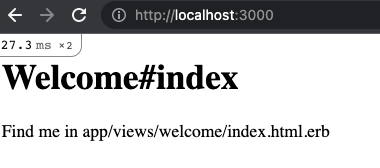

Notice we didn't have to explicitly render the template, there's no code in the controller action. Rails does all this by convention.

So far we have route, controller, and view.

Now need to add data model. Will use `scaffold` command to [generate](https://guides.rubyonrails.org/command_line.html#bin-rails-generate) everything needed:

```
bin/rails generate scaffold WikiPost
```

Output:

```
invoke  active_record
create    db/migrate/20220604121631_create_wiki_posts.rb
create    app/models/wiki_post.rb
invoke    test_unit
create      test/models/wiki_post_test.rb
create      test/fixtures/wiki_posts.yml
invoke  resource_route
 route    resources :wiki_posts
invoke  scaffold_controller
create    app/controllers/wiki_posts_controller.rb
invoke    erb
create      app/views/wiki_posts
create      app/views/wiki_posts/index.html.erb
create      app/views/wiki_posts/edit.html.erb
create      app/views/wiki_posts/show.html.erb
create      app/views/wiki_posts/new.html.erb
create      app/views/wiki_posts/_form.html.erb
invoke    resource_route
invoke    test_unit
create      test/controllers/wiki_posts_controller_test.rb
create      test/system/wiki_posts_test.rb
invoke    helper
create      app/helpers/wiki_posts_helper.rb
invoke      test_unit
invoke    jbuilder
create      app/views/wiki_posts/index.json.jbuilder
create      app/views/wiki_posts/show.json.jbuilder
create      app/views/wiki_posts/_wiki_post.json.jbuilder
invoke  assets
invoke    scss
create      app/assets/stylesheets/wiki_posts.scss
invoke  scss
create    app/assets/stylesheets/scaffolds.scss
```

This generated a database migration, when run, will generate a database table to contain our wiki posts. Right now, this table only has timestamps columns to persist when record was created and last updated:

```ruby
# wiki/db/migrate/20220604121631_create_wiki_posts.rb
class CreateWikiPosts < ActiveRecord::Migration[6.1]
  def change
    create_table :wiki_posts do |t|

      t.timestamps
    end
  end
end
```

Generated a model to define the data class:

```ruby
# wiki/app/models/wiki_post.rb
class WikiPost < ApplicationRecord
end
```

Generated a controller with all action methods needed to work with the model:

```ruby
# wiki/app/controllers/wiki_posts_controller.rb
class WikiPostsController < ApplicationController
  before_action :set_wiki_post, only: %i[ show edit update destroy ]

  # GET /wiki_posts or /wiki_posts.json
  def index
    @wiki_posts = WikiPost.all
  end

  # GET /wiki_posts/1 or /wiki_posts/1.json
  def show
  end

  # GET /wiki_posts/new
  def new
    @wiki_post = WikiPost.new
  end

  # GET /wiki_posts/1/edit
  def edit
  end

  # POST /wiki_posts or /wiki_posts.json
  def create
    @wiki_post = WikiPost.new(wiki_post_params)

    respond_to do |format|
      if @wiki_post.save
        format.html { redirect_to wiki_post_url(@wiki_post), notice: "Wiki post was successfully created." }
        format.json { render :show, status: :created, location: @wiki_post }
      else
        format.html { render :new, status: :unprocessable_entity }
        format.json { render json: @wiki_post.errors, status: :unprocessable_entity }
      end
    end
  end

  # PATCH/PUT /wiki_posts/1 or /wiki_posts/1.json
  def update
    respond_to do |format|
      if @wiki_post.update(wiki_post_params)
        format.html { redirect_to wiki_post_url(@wiki_post), notice: "Wiki post was successfully updated." }
        format.json { render :show, status: :ok, location: @wiki_post }
      else
        format.html { render :edit, status: :unprocessable_entity }
        format.json { render json: @wiki_post.errors, status: :unprocessable_entity }
      end
    end
  end

  # DELETE /wiki_posts/1 or /wiki_posts/1.json
  def destroy
    @wiki_post.destroy

    respond_to do |format|
      format.html { redirect_to wiki_posts_url, notice: "Wiki post was successfully destroyed." }
      format.json { head :no_content }
    end
  end

  private
    # Use callbacks to share common setup or constraints between actions.
    def set_wiki_post
      @wiki_post = WikiPost.find(params[:id])
    end

    # Only allow a list of trusted parameters through.
    def wiki_post_params
      params.fetch(:wiki_post, {})
    end
end
```

Controller has actions for:
* `show`: view a single instance of WikiPost model
* `index`: view all instances of WikiPost models
* `new`: create a new instance of WikiPost model
* `edit`: edit an existing instance of WikiPost model

Controller also supports json endpoints for API access.

The generator also added a `resources` method to the routes file to expose all the standard HTTP endpoints to manipulate the WikiPosts data model:

```ruby
# wiki/config/routes.rb
Rails.application.routes.draw do
  resources :wiki_posts
  get 'welcome/index'
  root 'welcome#index'
end
```

Trying to navigate to any of the endpoints, for example `http://localhost:3000/wiki_posts.json` results in an `ActiveRecord::PendingMigrationError`:

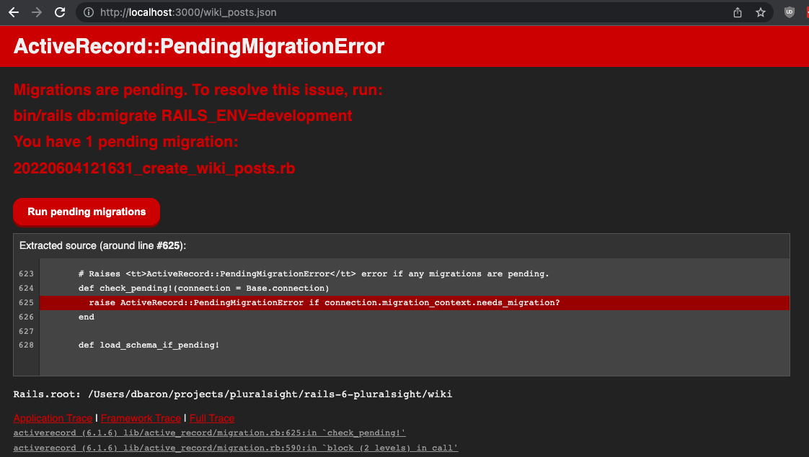

This is because the `scaffold` command we ran earlier generated a database migration for the WikiPosts model, but it hasn't been run yet.

Run db migration, this will add new table to persist WikiPosts data model to schema:

```
bin/rails db:migrate RAILS_ENV=development
```

Output:

```
== 20220604121631 CreateWikiPosts: migrating ==================================
-- create_table(:wiki_posts)
   -> 0.0025s
== 20220604121631 CreateWikiPosts: migrated (0.0026s) =========================
```

Restart server and navigate to `http://localhost:3000/wiki_posts.json` (get all wiki posts), and this time, it returns an empty json array (no more errors):

```json
[ ]
```

### Creating a Basic Static Page

Let's create a first example wiki post.

The scaffold generated some content in the wiki posts index view for us, which lists every existing data record, and a link to create a new one:

```ruby
<p id="notice"><%= notice %></p>

<h1>Wiki Posts</h1>

<table>
  <thead>
    <tr>
      <th colspan="3"></th>
    </tr>
  </thead>

  <tbody>
    <% @wiki_posts.each do |wiki_post| %>
      <tr>
        <td><%= link_to 'Show', wiki_post %></td>
        <td><%= link_to 'Edit', edit_wiki_post_path(wiki_post) %></td>
        <td><%= link_to 'Destroy', wiki_post, method: :delete, data: { confirm: 'Are you sure?' } %></td>
      </tr>
    <% end %>
  </tbody>
</table>

<br>

<%= link_to 'New Wiki Post', new_wiki_post_path %>
```

Let's delete the tabular display:

```ruby
# wiki/app/views/wiki_posts/index.html.erb
<p id="notice"><%= notice %></p>

<h1>Wiki Posts</h1>

<%= link_to 'New Wiki Post', new_wiki_post_path %>
```

This page will need an example wiki post, create this view as simple static html for now:

```html
<!-- wiki/app/views/wiki_posts/example.html.erb -->
<h1>Wiki Page Title</h1>

<p> Wiki Page Body</p>

<div>
  <span>Wiki Page Author</span>
  <span>Wiki Page Creation Date</span>
</div>
```

Now try navigating to display the example view at `http://localhost:3000/wiki_posts/example`, but get `ActiveRecord::RecordNotFound` error:

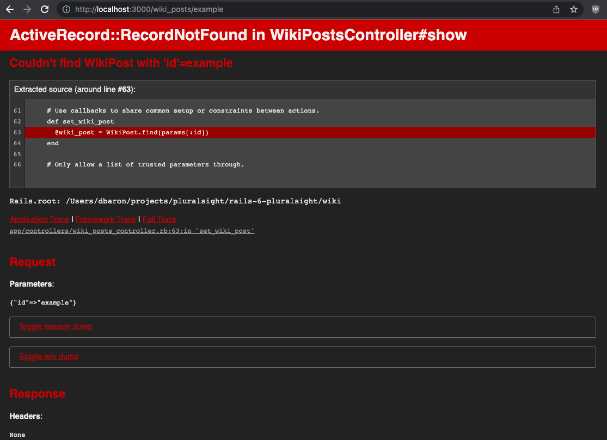

This is because a url like `GET /resource/:id` is mapped to the `show` method in the welcome controller, which will first attempt to find the WikiPost by the given `id` parameter in the url:

```ruby
# wiki/app/controllers/wiki_posts_controller.rb
class WikiPostsController < ApplicationController
  before_action :set_wiki_post, only: %i[ show edit update destroy ]

  # GET /wiki_posts/1 or /wiki_posts/1.json
  def show
  end

  # other methods...

  private
    def set_wiki_post
      @wiki_post = WikiPost.find(params[:id])
    end
end
```

So given a url like `wiki_posts/example`, it's trying to find a record in the wiki_posts table whose id is `example`, and there is no such thing.

Fix this: Change `show` method to render the example view just created. Also need to remove `show` from `before_action` list to stop Rails from trying to look up a specific record by id:

```ruby
# wiki/app/controllers/wiki_posts_controller.rb
before_action :set_wiki_post, only: %i[ edit update destroy ]

# GET /wiki_posts/1 or /wiki_posts/1.json
def show
  # will render wiki/app/views/wiki_posts/example.html.erb
  render "example"
end
```

Now it renders the example view:

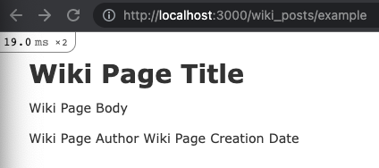

Change endpoint from `http://localhost:3000/wiki_posts/example` to `http://localhost:3000/wiki_posts/1` -> still renders same page. Because we overrode `show` method in controller to always render the same static page.

#### About Page

Adding another static page `welcome/about`.

Start by adding `about` method in the Welcome controller. Note that no method implementation needed, just the method name:

```ruby
# wiki/app/controllers/welcome_controller.rb
class WelcomeController < ApplicationController
  def index
  end

  def about
  end
end
```

Then create view which Rails will map controller action to by default:

```htm
<!-- wiki/app/views/welcome/about.html.erb -->
<h1>Wiki Information</h1>
```

Add a route for the about view:

```ruby
# wiki/config/routes.rb
Rails.application.routes.draw do
  resources :wiki_posts
  get 'welcome/index'
  get 'welcome/about'
  root 'welcome#index'
end
```

Navigate in browser to `http://localhost:3000/welcome/about`:

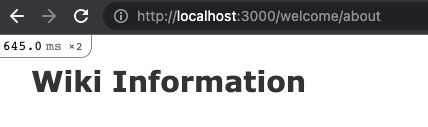

Now we want about page to be available at `/about` rather than `/welcome/about`. Use *redirect* for this with `to` in router:

```ruby
# wiki/config/routes.rb
Rails.application.routes.draw do
  resources :wiki_posts
  get 'welcome/index'
  get 'welcome/about'
  get '/about', to: redirect('/welcome/about')
  root 'welcome#index'
end
```

Now can navigate to `http://localhost:3000/about` and browser redirects to `http://localhost:3000/welcome/about` to display the about page.

#### Link to About Page from Index

Edit welcome index view to link to about page. No need to explicitly type out an anchor tag. Use some Ruby code that will generate it with the `link_to` method. Specify link text and path for this method

```erb
<!-- wiki/app/views/welcome/index.html.erb -->
<h1>Wiki</h1>
<p>Posts will go here</p>

<%= link_to "About", "/about" %>
```

Navigate to root to see this `http://localhost:3000`:

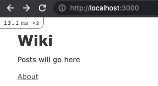

BUT notice the use of a hard-coded path passed to link_to method "/about". Any future change to paths would break this link. Better to use a variable `welcome_about_path`.

We haven't defined this variable - Rails "magic". Works because there's a "welcome" controller with an "about" action, so Rails exposes a variable `welcome_about_path` to link to this.

```erb
<!-- wiki/app/views/welcome/index.html.erb -->
<h1>Wiki</h1>
<p>Posts will go here</p>

<%= link_to "About", welcome_about_path %>
```

## Populating Pages in Rails

### Creating New Paths with Routes

Back to `wiki/app/controllers/wiki_posts_controller.rb`. Earlier we edited `show` method to render the static example page:

```ruby
# wiki/app/controllers/wiki_posts_controller.rb

def show
  render "example"
end
```

But that's not what a typical Rails app expects. `show` action should be used to show an instance of a model. Remove example code from `show` action and move to new action `example`:

```ruby
# wiki/app/controllers/wiki_posts_controller.rb
def show
end

def example
  render "example"
end
```

Now navigating to `http://localhost:3000/wiki_posts/example` get `ActionController::UrlGenerationError in WikiPosts#show`:

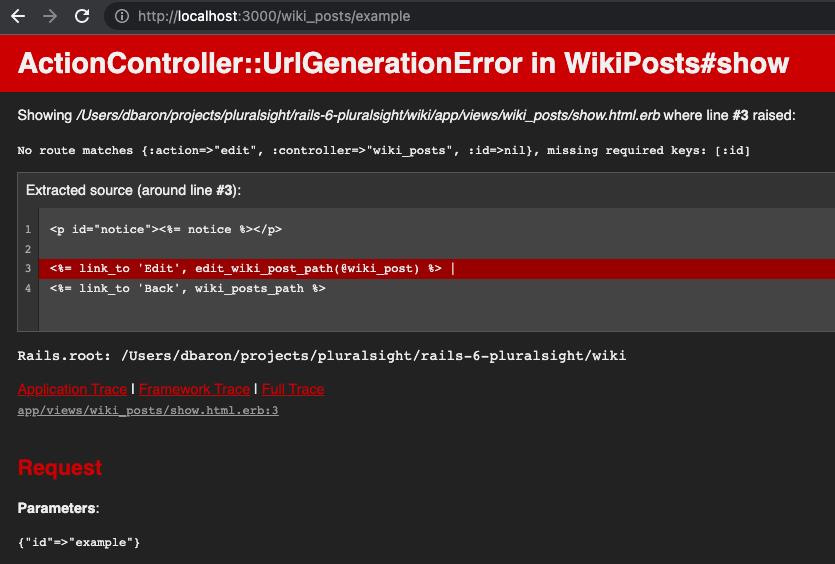

The problem is `/wiki_posts/example` is trying to load the `/show/:id` view because that's one of the routes exposed by `resources :wiki_posts` in the router file `wiki/config/routes.rb`.

To resolve this, need to define a route to the `example` action and point it to our controller. Add this line to router:

```ruby
# wiki/config/routes.rb
Rails.application.routes.draw do
  # expose example method in wiki_posts_controller as a route
  get 'wiki_posts/example'

  resources :wiki_posts
  get 'welcome/index'
  get 'welcome/about'
  get '/about', to: redirect('/welcome/about')
  root 'welcome#index'
end
```

With this fix, navigate to `http://localhost:3000/wiki_posts/example` and now example page renders.

How did Rails know what to do given this line in router file: `get 'wiki_posts/example'`?

It infers the `wiki_posts_controller` from `wiki_posts` in the router line. And it didn't attempt to load `/show/:id` route because it saw the specific line `get wiki_posts/example` in router *before* the `resources :wiki_posts` line.

In the case of potential multiple matching routes, Rails always maps to first route matched.

Another convention, the explicit render of example can be removed from the action, and Rails will still render the example view - it matches the view name to the controller action name:

```ruby
# wiki/app/controllers/wiki_posts_controller.rb
def example
end
```

#### Wiki Posts Model

Model is bare-bones at the moment with only timestamps columns. Use generator to add a migration to define further attributes for the model.

`g` is short for `generate`, which does something similar to `scaffold` but narrower scope. Naming convention for migrations is "add column to model". List of field names:datatype is last argument:

```
bin/rails g migration add_title_to_wiki_posts title:string
```

Output:

```
invoke  active_record
create    db/migrate/20220606103844_add_title_to_wiki_posts.rb
```

Rails writes the code to add the "title" column to the wiki_posts table in the migration:

```ruby
# wiki/db/migrate/20220606103844_add_title_to_wiki_posts.rb
class AddTitleToWikiPosts < ActiveRecord::Migration[6.1]
  def change
    add_column :wiki_posts, :title, :string
  end
end
```

Run the migration:

```
bin/rails db:migrate
```

Output:

```
== 20220606103844 AddTitleToWikiPosts: migrating ==============================
-- add_column(:wiki_posts, :title, :string)
   -> 0.0049s
== 20220606103844 AddTitleToWikiPosts: migrated (0.0050s) =====================
```

Use Rails console to make an instance of this model:

```
bin/rails c
```

```ruby
irb(main):001:0> WikiPost.new :title => "First Post"
   (1.1ms)  SELECT sqlite_version(*)
=> #<WikiPost id: nil, created_at: nil, updated_at: nil, title: "First Post">
```

Try to load this post in the browser view: `http://localhost/wiki_posts/1`. But get same error as before: `ActionController::UrlGenerationError in WikiPosts#show`.

Problem is `WikiPost.new...` created an instance of the model, but doesn't save to database.

Rails Active Record ORM (Object Relational Mapping) supports defining instances of classes (models in this case) in Ruby code, which represent data structure in db. This avoids having to explicitly connect to db in code and write sql queries.

But need to remember to *save* model instance to db, back in Rails console, use `create` method instead of `new` on WikiPost model class:

```ruby
irb(main):001:0> WikiPost.create(:title => "First Post")
TRANSACTION (1.0ms)  begin transaction
  WikiPost Create (2.8ms)  INSERT INTO "wiki_posts" ("created_at", "updated_at", "title") VALUES (?, ?, ?)  [["created_at", "2022-06-06 10:59:18.294132"], ["updated_at", "2022-06-06 10:59:18.294132"], ["title", "First Post"]]
  TRANSACTION (1.2ms)  commit transaction
=> #<WikiPost id: 1, created_at: "2022-06-06 10:59:18.294132000 +0000", updated_at: "2022-06-06 10:59:18.294132000 +0000", title: "First Post">
```

Also modify controller to put back temp change we made earlier to not have `show` method included in list of actions that would load a model instance by given `:id` in the route:

```ruby
# wiki/app/controllers/wiki_posts_controller.rb
before_action :set_wiki_post, only: %i[ edit update destroy show ]
```

Now rendering page `http://localhost:3000/wiki_posts/1` works:

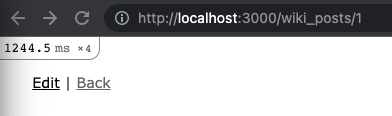

But the post appears empty. Need to manually add a title to the show view - use embedded ruby to render the title

```erb
<!-- wiki/app/views/wiki_posts/show.html.erb -->
<p id="notice"><%= notice %></p>

<h1><%= @wiki_post.title %></h1>

<%= link_to 'Edit', edit_wiki_post_path(@wiki_post) %> |
<%= link_to 'Back', wiki_posts_path %>
```

Now `http://localhost:3000/wiki_posts/1` renders the post title:

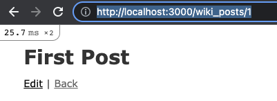

#### Rails Controller Actions

Summary of CRUD operations:

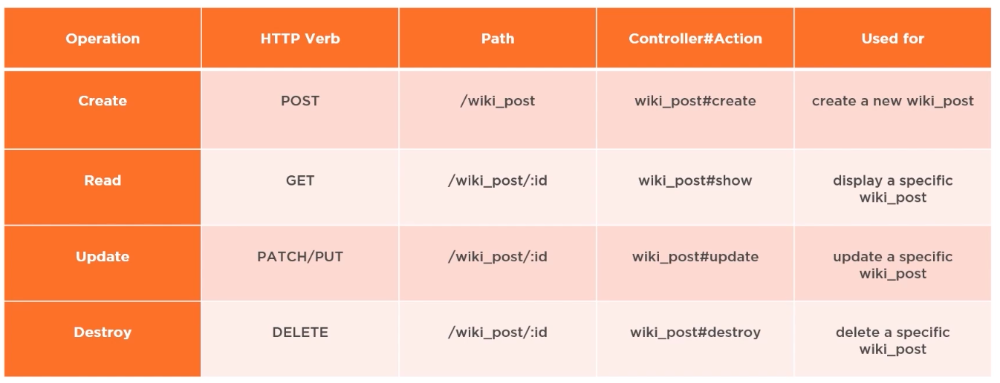

### Customizing Basic CSS

This section will add some temporary styles just to demonstrate the concept.

Start by adding classes to all elements in the example view:

```erb
<!-- wiki/app/views/wiki_posts/example.html.erb -->
<h1 class="title">Wiki Page Title</h1>

<p class="description"> Wiki Page Body</p>

<div class="meta">
  <span class="author">Wiki Page Author</span>
  <span class="creation">Wiki Page Creation Date</span>
  <span class="update">Wiki Page Last Update Date</span>
</div>
```

Navigate to `http://localhost:3000/wiki_posts/example`:

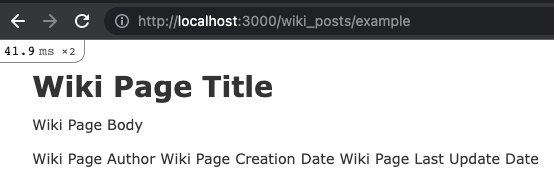

The scaffold command used earlier already created the css files where we should add our styles in `wiki/app/assets/stylesheets`:

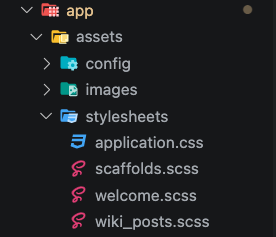

`wiki/app/assets/stylesheets/scaffolds.scss` contains styles related to Flash system messages (will be discussed later).

The main application view (also generated by scaffold) contains a link to the application stylesheet using a method `stylesheet_link_tag` which loads the css file by name, and also accepts some other parameters:

```erb
<!-- wiki/app/views/layouts/application.html.erb -->
<!DOCTYPE html>
<html>
  <head>
    <title>Wiki</title>
    <meta name="viewport" content="width=device-width,initial-scale=1">
    <%= csrf_meta_tags %>
    <%= csp_meta_tag %>

    <%= stylesheet_link_tag 'application', media: 'all', 'data-turbolinks-track': 'reload' %>
    <%= javascript_pack_tag 'application', 'data-turbolinks-track': 'reload' %>
  </head>

  <body>
    <%= yield %>
  </body>
</html>
```

Notice that only the main application file has `.css` extension, the others have `.scss`, which supports variables, nesting, and inheritance.

Put all styles associated with a view in the same named `.scss` file. Any valid css is also valid scss so for this course will use that and keep the styles simple. Copy styles from module 3 branch of instructor's [repo](https://github.com/XFactor-Consultants/Ruby-Getting-Started/blob/module-3/app/assets/stylesheets/wiki_posts.scss):

```scss
// wiki/app/assets/stylesheets/wiki_posts.scss
$border-radius: 4px;

html, body {
  background-color: black;
  color: white;
  font-family: 'Segoe UI', Tahoma, Geneva, Verdana, sans-serif;
  display: flex;
  justify-content: center;
  flex-direction: column;
  align-items: center;

  h1 {
    font-size: 2.5em;
  }
  .description {
    background-color: rgba(255, 255, 255, 0.199);
    padding: 1em;
    font-size: 1.2em;
    border-radius: $border-radius;
    max-width: 600px;
  }
  // ...
}
```

Refresh browser and now `http://localhost:3000/wiki_posts/example` is styled like this:

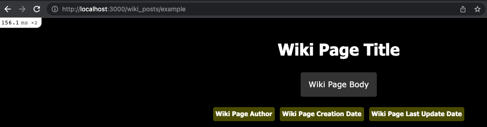

To see how this page might look with real content, hard-code some [lorem ipsum](https://loremipsum.io/generator/?n=1&t=p) text into the view:

```erb
<!-- wiki/app/views/wiki_posts/example.html.erb -->
<h1 class="title">Lorem Impsum</h1>

<p class="description">Lorem ipsum dolor sit amet, consectetur adipiscing elit, sed do eiusmod tempor incididunt ut labore et dolore magna aliqua. Maecenas ultricies mi eget mauris. Nisl rhoncus mattis rhoncus urna neque viverra. Gravida dictum fusce ut placerat. Tortor vitae purus faucibus ornare. Maecenas ultricies mi eget mauris pharetra. Nec feugiat nisl pretium fusce id. In tellus integer feugiat scelerisque varius. Vestibulum lectus mauris ultrices eros in cursus turpis massa tincidunt. Consequat semper viverra nam libero justo laoreet sit. Sapien et ligula ullamcorper malesuada proin libero. Sit amet luctus venenatis lectus magna fringilla. Neque convallis a cras semper auctor neque vitae tempus. Quisque id diam vel quam. Tempus imperdiet nulla malesuada pellentesque elit eget gravida cum. Tempor commodo ullamcorper a lacus vestibulum sed arcu non odio. Convallis tellus id interdum velit laoreet id donec ultrices.</p>

<div class="meta">
  <span class="author">Wiki Page Author</span>
  <span class="creation">Wiki Page Creation Date</span>
  <span class="update">Wiki Page Last Update Date</span>
</div>
```

Refresh `http://localhost:3000/wiki_posts/example`:

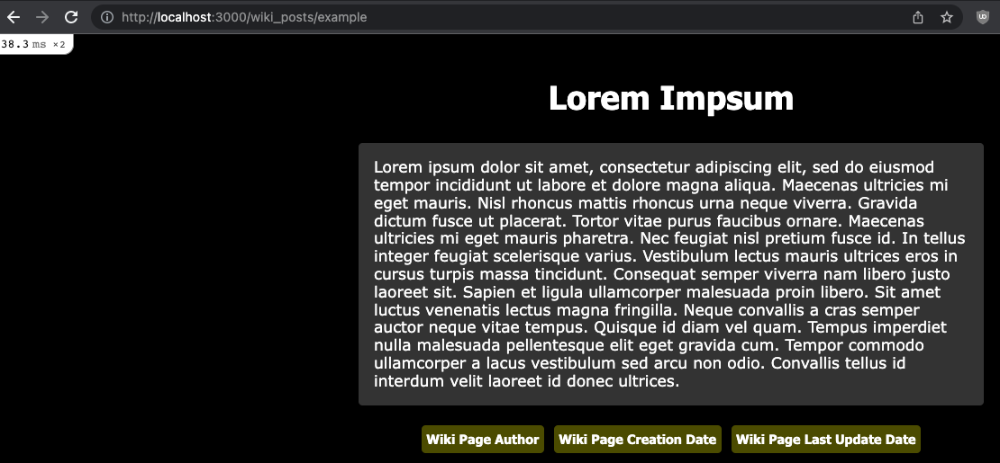

Now update example view with a link back to home page and a link to create a new post. Run `bin/rails routes` to see available path variable names:

```erb
<!-- wiki/app/views/wiki_posts/example.html.erb -->
<!-- ... -->
<div class="links">
  <%= link_to "Home", welcome_index_path %>
  <%= link_to "New Wiki Post", new_wiki_post_path %>
</div>
```

Refresh `http://localhost:3000/wiki_posts/example`:

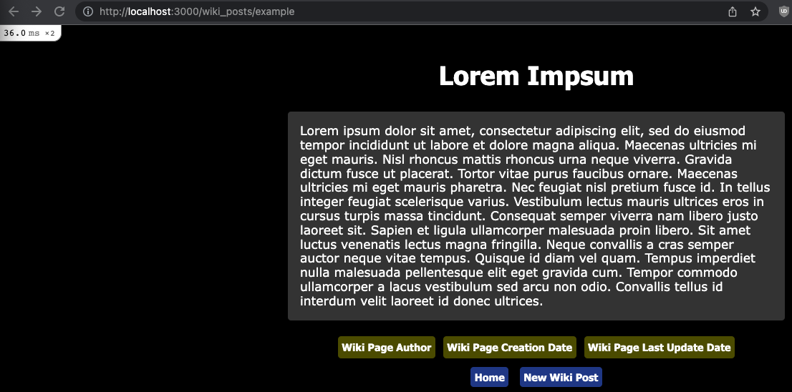

Clicking Home links to `http://localhost:3000/welcome/index` and New Wiki Post links to `http://localhost:3000/wiki_posts/new`

Index page `http://localhost:3000/` currently looks like this:

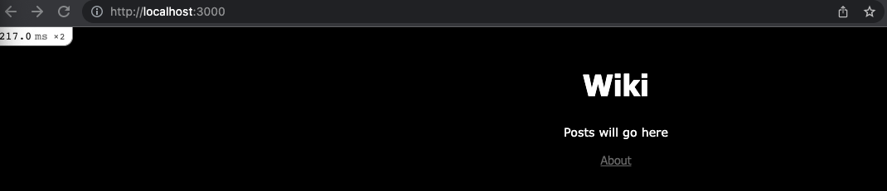

Now that there's a posts model with at least one instance created, can replace "Posts will go here" placeholder text with real content.

In order for the posts to be available to the index view (welcome/index), the controller index action must assign an instance variable `@posts` to contain the results of all the wiki posts.

```ruby
# wiki/app/controllers/welcome_controller.rb
class WelcomeController < ApplicationController
  def index
    @posts = WikiPost.all
  end

  def about
  end
end
```

`@` makes `@posts` an instance variable which means it can be accessed across the current instance of this class `WelcomeController` no matter what the scope is. The welcome/index view is within the same instance of the `WelcomeController` class, which means `@` instance variables can be shared between controller and view.

Update view to loop through each post in the `@posts` collection and display it using embedded Ruby tag `<% ... %>` and display each posts title.

Also use `link_to` to generate a link to that posts details view, note that since this route requires the post `id` parameter, need to pass the model instance in as a parameter to that `wiki_post_path` variable/method.

Note that `<%= ... %>` is for a single line of Ruby, whereas `<% ...%>` is for a multi-line block:

```erb
<!-- wiki/app/views/welcome/index.html.erb -->
<h1>Wiki</h1>

<% @posts.each do |post| %>
  <p>
    <h4><%= post.title %></h4>
    <%= link_to "View", wiki_post_path(post) %>
  </p>
<% end %>

<%= link_to "About", welcome_about_path %>
```

Refresh `http://localhost:3000/` to see listing of wiki posts (we just have one instance for now) and View link:

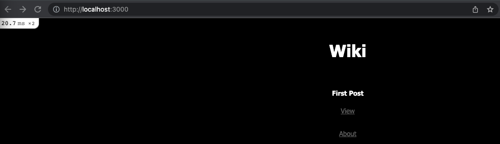

Clicking View link navigates to "show" view for that post id: `http://localhost:3000/wiki_posts/1`

### Implementing JavaScript

Uses Webpack. Rails comes with webpacker, which handles all the Webpack configuration. Makes it easy to add JS to the app. Just import any modules to be loaded into index.js.

Example: Add a confirmation before loading a wiki post, when user clicks View link from home page, will receive browser prompt asking if they really want to view this post.

Start by adding a css class to the view link using the `class` parameter in `link_to` method. The JS will use this to select this link later:

```erb
<!-- wiki/app/views/welcome/index.html.erb -->
<h1>Wiki</h1>

<% @posts.each do |post| %>
  <p>
    <h4><%= post.title %></h4>
    <%= link_to "View", wiki_post_path(post), class: 'wikiLink' %>
  </p>
<% end %>

<%= link_to "About", welcome_about_path %>
```

Verify in dev tools, the view link gets rendered as:

```htm
<a class="wikiLink" href="/wiki_posts/1">View</a>
```

Javascript imports get added to `application.js`, the main javascript entry point for app. Everything in this file gets compiled by webpacker into the main application.

```javascript
// wiki/app/javascript/packs/application.js
// This file is automatically compiled by Webpack, along with any other files
// present in this directory. You're encouraged to place your actual application logic in
// a relevant structure within app/javascript and only use these pack files to reference
// that code so it'll be compiled.

import Rails from "@rails/ujs"
import Turbolinks from "turbolinks"
import * as ActiveStorage from "@rails/activestorage"
import "channels"

// Add our view specific module here
import "../welcome"

Rails.start()
Turbolinks.start()
ActiveStorage.start()
```

Here is `welcome.js`:

```javascript
// wiki/app/javascript/welcome.js
const ready = () => {
  const links = document.getElementsByClassName('wikiLink')
  for (link of links) {
    console.log(link)
  }
}

document.addEventListener("DOMContentLoaded", ready);
```

JavaScript gets loaded *before* the DOM does, that's why it needs to listen for `DOMContentLoaded` event before attempting to query for links by css class name.

Refresh `http://localhost:3000/` in browser, watch Rails server console, it will run webpacker compile and then render view again:

```
[Webpacker] Compiling...
[Webpacker] Compiled all packs in /Users/dbaron/projects/pluralsight/rails-6-pluralsight/wiki/public/packs
[Webpacker] Hash: 0861d71bf670fe86582b
Version: webpack 4.46.0
Time: 1624ms
Built at: 06/09/2022 6:35:50 AM
                                     Asset       Size       Chunks                         Chunk Names
    js/application-97a8e49ff7b69297899d.js    127 KiB  application  [emitted] [immutable]  application
js/application-97a8e49ff7b69297899d.js.map    139 KiB  application  [emitted] [dev]        application
                             manifest.json  364 bytes               [emitted]
Entrypoint application = js/application-97a8e49ff7b69297899d.js js/application-97a8e49ff7b69297899d.js.map
[./app/javascript/channels sync recursive _channel\.js$] ./app/javascript/channels sync _channel\.js$ 160 bytes {application} [built]
[./app/javascript/channels/index.js] 211 bytes {application} [built]
[./app/javascript/packs/application.js] 513 bytes {application} [built]
[./app/javascript/welcome.js] 1.98 KiB {application} [built]
[./node_modules/webpack/buildin/module.js] (webpack)/buildin/module.js 552 bytes {application} [built]
    + 3 hidden modules

  Rendered layout layouts/application.html.erb (Duration: 5898.5ms | Allocations: 6497)
Completed 200 OK in 5914ms (Views: 5901.2ms | ActiveRecord: 8.3ms | Allocations: 6896)
```

Then looking at Console in browser, can see the View link logged there.

Update `welcome.js` to add a click event listener to link, that for now, simply logs to console:

```javascript
// wiki/app/javascript/welcome.js
const ready = () => {
  const links = document.getElementsByClassName('wikiLink')
  for (link of links) {
    console.log(link)
  }
}

document.addEventListener("DOMContentLoaded", ready);
```

Again refresh `http://localhost:3000/`, wait for Webpack compile to finish in Rails console, then click on View link from homepage. This time it logs the PointerEvent to console, and then navigates to View wiki post page `http://localhost:3000/wiki_posts/1`:

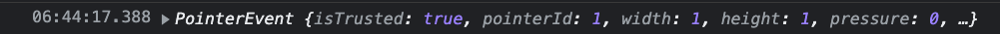

To implement a confirmation popup in js, interrupt the link click event with an anonymous function on the link click listener.

`e.preventDefault()` prevents the navigation from happening, which is the default browser behaviour from clicking the link.

Then display confirmation popup. If user clicks Cancel from this popup, return from function and no navigation takes place in the browser.

If user clicks Confirm from popup, then JS gets url from the link element, and use JS navigation to take user to the View page:

```javascript
// wiki/app/javascript/welcome.js
const ready = () => {
  const links = document.getElementsByClassName('wikiLink')
  for (link of links) {
    link.addEventListener("click", e => {
      e.preventDefault();
      if(!confirm("Are you sure you want to view this article?")) {
        return
      }
      window.location.href = link.href
    })
  }
}

document.addEventListener("DOMContentLoaded", ready);
```

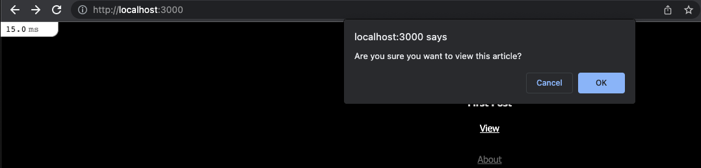

### Summary

* Rails generates routes automatically, naming convention: `controller name_action name_path name`
* CRUD: Create, Read, Update, Destroy
* Rails supports SCSS styling by default
* JS lives in the `app/javascript` folder and is compiled automatically by Webpacker/webpack.

## Building Dynamic Web Apps with MVC's

For this section, updated styles copied from [module-4](https://github.com/XFactor-Consultants/Ruby-Getting-Started/tree/module-4/app/assets/stylesheets) branch of instructor's repo.

### Working with ActiveStorage

Currently posts only have:
* updated_at
* created_at
* id
* title

To add a real post, need:
* author
* image
* description

Adding author and description, simple text fields is straightforward. But how to deal with files for the post image?

Relational databases are capable of storing blob's (binary content) but its inefficient. DB not designed to store terabytes of image file data. Database could exceed theoretical file size limit of NTFS.

Solution: Store files as files, no need to encode/decode them to/from a database.

ActiveStorage is a tool that ships with Rails and designed for storing files associated with models. Comes with a lot of config options for how to store files.

By default, for local/dev, stores in a local file in project named `storage`.

Run this command to enable it:

```bash
bin/rails active_storage:install
# Copied migration 20220610113424_create_active_storage_tables.active_storage.rb from active_storage
```

Creates a migration for the database. These new tables will associate a file in some storage to the database. A database record could have one or many files attached to it. Files can be attached to any number of records. aka many-to-many relationship between files and records.

```ruby
# wiki/db/migrate/20220610113424_create_active_storage_tables.active_storage.rb
# This migration comes from active_storage (originally 20170806125915)
class CreateActiveStorageTables < ActiveRecord::Migration[5.2]
  def change
    create_table :active_storage_blobs do |t|
      t.string   :key,          null: false
      t.string   :filename,     null: false
      t.string   :content_type
      t.text     :metadata
      t.string   :service_name, null: false
      t.bigint   :byte_size,    null: false
      t.string   :checksum,     null: false
      t.datetime :created_at,   null: false

      t.index [ :key ], unique: true
    end

    create_table :active_storage_attachments do |t|
      t.string     :name,     null: false
      t.references :record,   null: false, polymorphic: true, index: false
      t.references :blob,     null: false

      t.datetime :created_at, null: false

      t.index [ :record_type, :record_id, :name, :blob_id ], name: "index_active_storage_attachments_uniqueness", unique: true
      t.foreign_key :active_storage_blobs, column: :blob_id
    end

    create_table :active_storage_variant_records do |t|
      t.belongs_to :blob, null: false, index: false
      t.string :variation_digest, null: false

      t.index %i[ blob_id variation_digest ], name: "index_active_storage_variant_records_uniqueness", unique: true
      t.foreign_key :active_storage_blobs, column: :blob_id
    end
  end
end
```

Now run the migration:

```
bin/rails db:migrate
```

Output:

```
== 20220610113424 CreateActiveStorageTables: migrating ========================
-- create_table(:active_storage_blobs, {})
   -> 0.0039s
-- create_table(:active_storage_attachments, {})
   -> 0.0032s
-- create_table(:active_storage_variant_records, {})
   -> 0.0021s
== 20220610113424 CreateActiveStorageTables: migrated (0.0094s) ===============
```

To attach a file to a model, use the `has_one_attached` method. This tells ActiveStorage that it can attach/save files (image in this case) to the model:

```ruby
# wiki/app/models/wiki_post.rb
class WikiPost < ApplicationRecord
  has_one_attached :image
end
```

Add remainder of needed columns to the WikiPost model. Use the migration generator:

```bash
bin/rails g migration add_author_description_to_wiki_post
```

Output:

```
invoke  active_record
create    db/migrate/20220610114400_add_author_description_to_wiki_post.rb
```

This generated a migration file but we have to fill in the details in the `change` method:

```ruby
# wiki/db/migrate/20220610114400_add_author_description_to_wiki_post.rb
class AddAuthorDescriptionToWikiPost < ActiveRecord::Migration[6.1]
  def change
    # add our columns here:
    add_column :wiki_posts, :description, :string
    add_column :wiki_posts, :author, :string
  end
end
```

Run this migration:

```
bin/rails db:migrate
```

Output:

```
== 20220610114400 AddAuthorDescriptionToWikiPost: migrating ===================
== 20220610114400 AddAuthorDescriptionToWikiPost: migrated (0.0000s) ==========
```

#### Create and Edit Posts

Need to implement create and edit posts feature for users of the wiki site.

Add link to homepage so that user can create a new post, it can be similar to the about link, but use variable `new_wiki_post_path` (can find this from `bin/rails routes`):

```erb
<!-- wiki/app/views/welcome/index.html.erb -->
<h1>Wiki</h1>

<% @posts.each do |post| %>
  <p>
    <h4><%= post.title %></h4>
    <%= link_to "View", wiki_post_path(post), class: 'wikiLink' %>
  </p>
<% end %>

<%= link_to "About", welcome_about_path %>
<%= link_to "New post", new_wiki_post_path %>
```

Now homepage contains New post link:

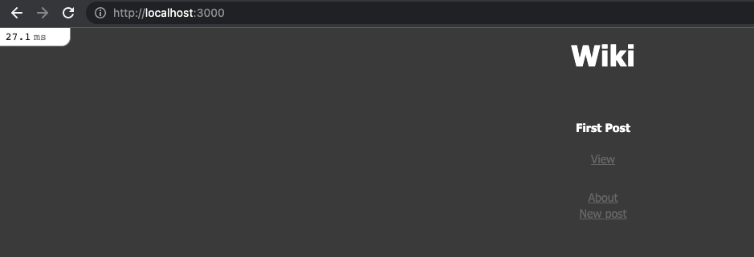

Clicking on new post link navigates to `http://localhost:3000/wiki_posts/new`:

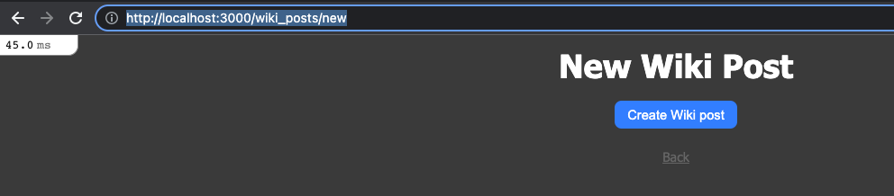

The new post page should have a form for user to provide info to create a new post, but currently its empty. Why? Earlier when used the `scaffold` command to generate the WikiPost model `bin/rails generate scaffold WikiPost`, didn't specify any fields, so Rails generated an empty form in the new view using `render` method with the argument `'form'`, which is a partial:

```erb
<!-- wiki/app/views/wiki_posts/new.html.erb -->
<h1>New Wiki Post</h1>

<%= render 'form', wiki_post: @wiki_post %>

<%= link_to 'Back', wiki_posts_path %>
```

```erb
<!-- wiki/app/views/wiki_posts/_form.html.erb -->
<%= form_with(model: wiki_post) do |form| %>
  <% if wiki_post.errors.any? %>
    <div id="error_explanation">
      <h2><%= pluralize(wiki_post.errors.count, "error") %> prohibited this wiki_post from being saved:</h2>

      <ul>
        <% wiki_post.errors.each do |error| %>
          <li><%= error.full_message %></li>
        <% end %>
      </ul>
    </div>
  <% end %>

  <div class="actions">
    <%= form.submit %>
  </div>
<% end %>
```

Here is the markup Rails generates for the form:

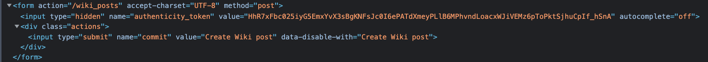

#### Using form_with

The built-in Rails helper `form_with` renders an html form. The basic usage is as follows:

```erb
<%= form_with do |form| %>
  Form contents
<%= end %>
```

Update `_form.html.erb` to display form label and inputs for the WikiPost title, description, and author name:

```erb
<!-- wiki/app/views/wiki_posts/_form.html.erb -->
<%= form_with(model: wiki_post) do |form| %>
  <%= form.label :title, "Post title" %>
  <%= form.text_field :title %>

  <%= form.label :description, "Post description" %>
  <%= form.text_field :description %>

  <%= form.label :author, "What is your name?" %>
  <%= form.text_field :author %>

  <div class="actions">
    <%= form.submit %>
  </div>
<% end %>
```

Renders like this:

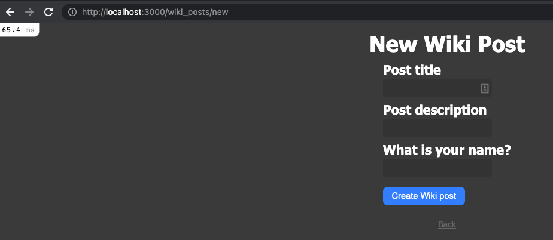

And here's the markup that the `form_with` helper generated this time:

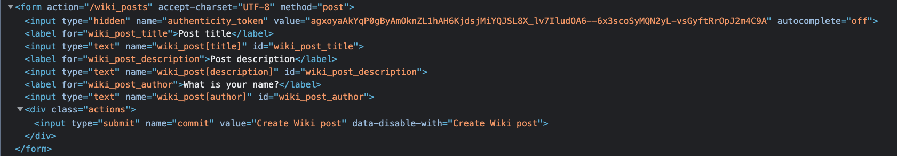

#### Add Image Upload

No need to write any JavaScript file uploader. We just need an input type = file. Add a field similar to title, but instead of `text_field`, use `file_field`:

```erb
<!-- wiki/app/views/wiki_posts/_form.html.erb -->
<%= form_with(model: wiki_post) do |form| %>
  <%= form.label :title, "Post title" %>
  <%= form.text_field :title %>

  <%= form.label :image, "Post image" %>
  <%= form.file_field :image %>

  <%= form.label :description, "Post description" %>
  <%= form.text_field :description %>

  <%= form.label :author, "What is your name?" %>
  <%= form.text_field :author %>

  <div class="actions">
    <%= form.submit %>
  </div>
<% end %>
```

Now the form displays with a Choose File button:

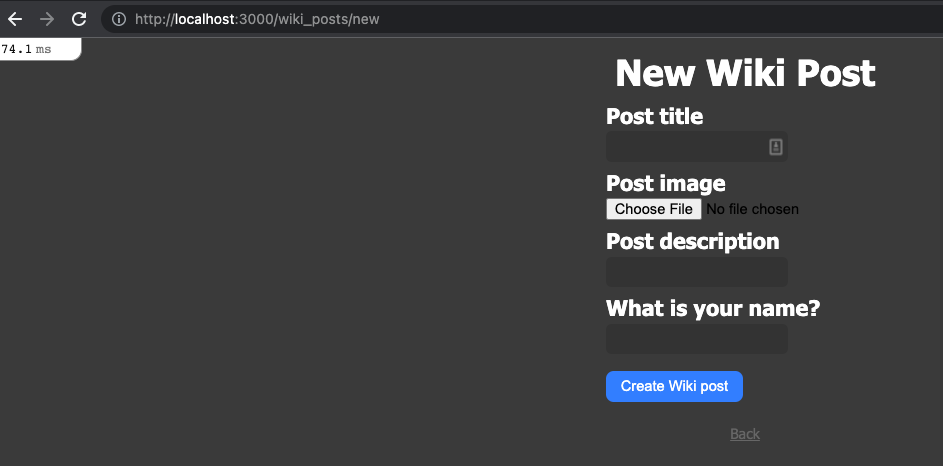

Here's the markup generated by `form.file_field`:

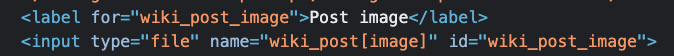

Try out the form selecting `images/header-ruby-logo.png` for the post image:

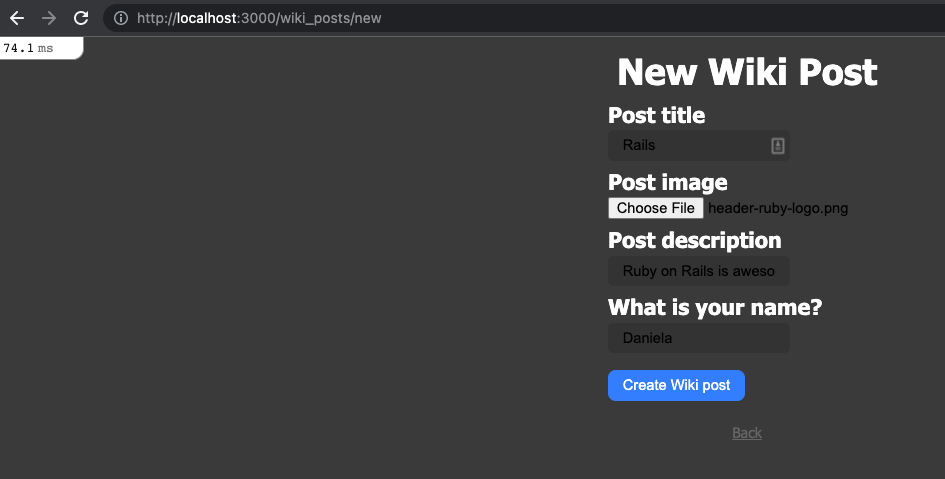

Click submit button, get `ActiveModel::ForbiddenAttributesError` error:

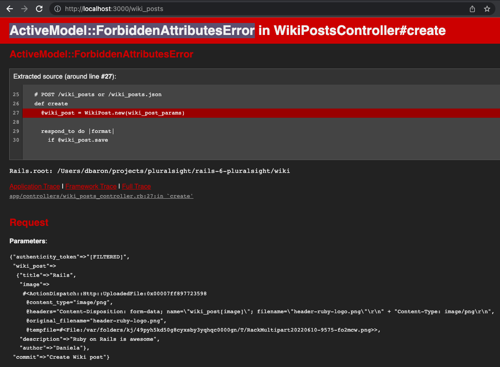

This is coming from the WikiPosts controller `create` method. It receives all the parameters from the form, but we need to explicitly tell Rails what fields are allowed to be used in creating a WikiPost model. For security reasons, wouldn't want a user to attempt to set an id or role field.

The scaffold command used earlier `bin/rails generate scaffold WikiPost` would have specified this in the controller, but at the time, the WikiPost model didn't have any fields. So now we need to do this.

Here's the current controller code from scaffolding, notice, no fields are allowed in method `wiki_post_params`, only relevant code shown for brevity:

```ruby
# wiki/app/controllers/wiki_posts_controller.rb
class WikiPostsController < ApplicationController
  # GET /wiki_posts/new
  def new
    @wiki_post = WikiPost.new
  end

  # POST /wiki_posts or /wiki_posts.json
  def create
    @wiki_post = WikiPost.new(wiki_post_params)

    respond_to do |format|
      if @wiki_post.save
        format.html { redirect_to wiki_post_url(@wiki_post), notice: "Wiki post was successfully created." }
        format.json { render :show, status: :created, location: @wiki_post }
      else
        format.html { render :new, status: :unprocessable_entity }
        format.json { render json: @wiki_post.errors, status: :unprocessable_entity }
      end
    end
  end

  private
    # Only allow a list of trusted parameters through.
    def wiki_post_params
      params.fetch(:wiki_post, {})
    end
end
```

Update `wiki_post_params` method to allow the fields needed to create a WikiPost that a user can specify:

```ruby
def wiki_post_params
  params.fetch(:wiki_post, {}).permit(:title, :description, :image, :author)
end
```

Now fill out the form in UI and try to create again - this time it works, and lands on the show post page `http://localhost:3000/wiki_posts/3` (because this is where the `create` method redirects to up on successful saving of newly created model):

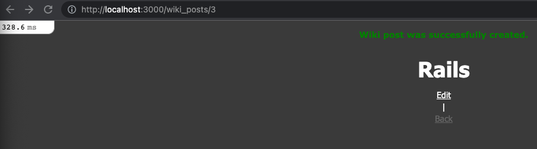

Output from Rails console shows queries that were run to create the new model and associated active storage for image:

```
Started POST "/wiki_posts" for ::1 at 2022-06-10 08:48:16 -0400
Processing by WikiPostsController#create as HTML
  Parameters: {"authenticity_token"=>"[FILTERED]", "wiki_post"=>{"title"=>"Rails", "image"=>#<ActionDispatch::Http::UploadedFile:0x00007ff38b580008 @tempfile=#<Tempfile:/var/folders/kj/49pyh5kd50g8cyxsby3yqhqc0000gn/T/RackMultipart20220610-13302-1u5wmxv.png>, @original_filename="header-ruby-logo.png", @content_type="image/png", @headers="Content-Disposition: form-data; name=\"wiki_post[image]\"; filename=\"header-ruby-logo.png\"\r\nContent-Type: image/png\r\n">, "description"=>"Rails is awesome", "author"=>"Daniela"}, "commit"=>"Create Wiki post"}
  TRANSACTION (0.1ms)  begin transaction
  ↳ app/controllers/wiki_posts_controller.rb:30:in `block in create'
  WikiPost Create (1.0ms)  INSERT INTO "wiki_posts" ("created_at", "updated_at", "title", "description", "author") VALUES (?, ?, ?, ?, ?)  [["created_at", "2022-06-10 12:48:16.340165"], ["updated_at", "2022-06-10 12:48:16.340165"], ["title", "Rails"], ["description", "Rails is awesome"], ["author", "Daniela"]]
  ↳ app/controllers/wiki_posts_controller.rb:30:in `block in create'
  ActiveStorage::Blob Load (0.9ms)  SELECT "active_storage_blobs".* FROM "active_storage_blobs" INNER JOIN "active_storage_attachments" ON "active_storage_blobs"."id" = "active_storage_attachments"."blob_id" WHERE "active_storage_attachments"."record_id" = ? AND "active_storage_attachments"."record_type" = ? AND "active_storage_attachments"."name" = ? LIMIT ?  [["record_id", 3], ["record_type", "WikiPost"], ["name", "image"], ["LIMIT", 1]]
  ↳ app/controllers/wiki_posts_controller.rb:30:in `block in create'
  ActiveStorage::Attachment Load (0.2ms)  SELECT "active_storage_attachments".* FROM "active_storage_attachments" WHERE "active_storage_attachments"."record_id" = ? AND "active_storage_attachments"."record_type" = ? AND "active_storage_attachments"."name" = ? LIMIT ?  [["record_id", 3], ["record_type", "WikiPost"], ["name", "image"], ["LIMIT", 1]]
  ↳ app/controllers/wiki_posts_controller.rb:30:in `block in create'
  ActiveStorage::Blob Create (0.5ms)  INSERT INTO "active_storage_blobs" ("key", "filename", "content_type", "metadata", "service_name", "byte_size", "checksum", "created_at") VALUES (?, ?, ?, ?, ?, ?, ?, ?)  [["key", "2zcagi3aaqffztmnulu6x6ur2hqu"], ["filename", "header-ruby-logo.png"], ["content_type", "image/png"], ["metadata", "{\"identified\":true}"], ["service_name", "local"], ["byte_size", 5365], ["checksum", "LQtcqjFqw+UGHetMpabgwg=="], ["created_at", "2022-06-10 12:48:16.405466"]]
  ↳ app/controllers/wiki_posts_controller.rb:30:in `block in create'
  ActiveStorage::Attachment Create (0.5ms)  INSERT INTO "active_storage_attachments" ("name", "record_type", "record_id", "blob_id", "created_at") VALUES (?, ?, ?, ?, ?)  [["name", "image"], ["record_type", "WikiPost"], ["record_id", 3], ["blob_id", 1], ["created_at", "2022-06-10 12:48:16.409309"]]
  ↳ app/controllers/wiki_posts_controller.rb:30:in `block in create'
  WikiPost Update (0.1ms)  UPDATE "wiki_posts" SET "updated_at" = ? WHERE "wiki_posts"."id" = ?  [["updated_at", "2022-06-10 12:48:16.417436"], ["id", 3]]
  ↳ app/controllers/wiki_posts_controller.rb:30:in `block in create'
  TRANSACTION (1.0ms)  commit transaction
  ↳ app/controllers/wiki_posts_controller.rb:30:in `block in create'
  Disk Storage (1.8ms) Uploaded file to key: 2zcagi3aaqffztmnulu6x6ur2hqu (checksum: LQtcqjFqw+UGHetMpabgwg==)
[ActiveJob] Enqueued ActiveStorage::AnalyzeJob (Job ID: 95b96ccd-96af-413c-be96-5a7e5b975963) to Async(default) with arguments: #<GlobalID:0x00007ff38b429060 @uri=#<URI::GID gid://wiki/ActiveStorage::Blob/1>>
Redirected to http://localhost:3000/wiki_posts/3
Completed 302 Found in 179ms (ActiveRecord: 5.4ms | Allocations: 34585)


  ActiveStorage::Blob Load (0.3ms)  SELECT "active_storage_blobs".* FROM "active_storage_blobs" WHERE "active_storage_blobs"."id" = ? LIMIT ?  [["id", 1], ["LIMIT", 1]]
[ActiveJob] [ActiveStorage::AnalyzeJob] [95b96ccd-96af-413c-be96-5a7e5b975963] Performing ActiveStorage::AnalyzeJob (Job ID: 95b96ccd-96af-413c-be96-5a7e5b975963) from Async(default) enqueued at 2022-06-10T12:48:16Z with arguments: #<GlobalID:0x00007ff38b410010 @uri=#<URI::GID gid://wiki/ActiveStorage::Blob/1>>
[ActiveJob] [ActiveStorage::AnalyzeJob] [95b96ccd-96af-413c-be96-5a7e5b975963]   Disk Storage (0.4ms) Downloaded file from key: 2zcagi3aaqffztmnulu6x6ur2hqu
[ActiveJob] [ActiveStorage::AnalyzeJob] [95b96ccd-96af-413c-be96-5a7e5b975963] Skipping image analysis because the mini_magick gem isn't installed
[ActiveJob] [ActiveStorage::AnalyzeJob] [95b96ccd-96af-413c-be96-5a7e5b975963]   TRANSACTION (0.1ms)  begin transaction
[ActiveJob] [ActiveStorage::AnalyzeJob] [95b96ccd-96af-413c-be96-5a7e5b975963]   ActiveStorage::Blob Update (0.4ms)  UPDATE "active_storage_blobs" SET "metadata" = ? WHERE "active_storage_blobs"."id" = ?  [["metadata", "{\"identified\":true,\"analyzed\":true}"], ["id", 1]]
[ActiveJob] [ActiveStorage::AnalyzeJob] [95b96ccd-96af-413c-be96-5a7e5b975963]   TRANSACTION (0.7ms)  commit transaction
[ActiveJob] [ActiveStorage::AnalyzeJob] [95b96ccd-96af-413c-be96-5a7e5b975963] Performed ActiveStorage::AnalyzeJob (Job ID: 95b96ccd-96af-413c-be96-5a7e5b975963) from Async(default) in 144.17ms
Started GET "/wiki_posts/3" for ::1 at 2022-06-10 08:48:16 -0400
Processing by WikiPostsController#show as HTML
  Parameters: {"id"=>"3"}
  WikiPost Load (0.2ms)  SELECT "wiki_posts".* FROM "wiki_posts" WHERE "wiki_posts"."id" = ? LIMIT ?  [["id", 3], ["LIMIT", 1]]
  ↳ app/controllers/wiki_posts_controller.rb:66:in `set_wiki_post'
  Rendering layout layouts/application.html.erb
  Rendering wiki_posts/show.html.erb within layouts/application
  Rendered wiki_posts/show.html.erb within layouts/application (Duration: 7.3ms | Allocations: 264)
[Webpacker] Everything's up-to-date. Nothing to do
  Rendered layout layouts/application.html.erb (Duration: 15.8ms | Allocations: 4009)
Completed 200 OK in 32ms (Views: 28.5ms | ActiveRecord: 0.2ms | Allocations: 5187)
```

Update the show view to display all the wiki fields (will deal with image later):

```erb
<!-- wiki/app/views/wiki_posts/show.html.erb -->
<p id="notice"><%= notice %></p>

<h1><%= @wiki_post.title %></h1>
<p><%= @wiki_post.description %></p>
<p>By: <%= @wiki_post.author %></p>
<p>Created: <%= @wiki_post.created_at %></p>
<p>Updated: <%= @wiki_post.updated_at %></p>

<%= link_to 'Edit', edit_wiki_post_path(@wiki_post) %> |
<%= link_to 'Back', wiki_posts_path %>
```

Show the post created earlier with the form at `http://localhost:3000/wiki_posts/3`:

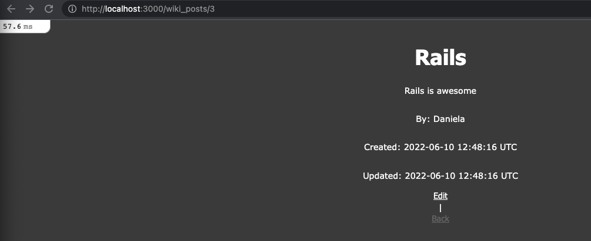

Now update view to show the wiki post image - instructor did not explain this!

```erb
<!-- wiki/app/views/wiki_posts/show.html.erb -->
<p id="notice"><%= notice %></p>

<h1><%= @wiki_post.title %></h1>
<p><%= image_tag @wiki_post.image %></p>
<p><%= @wiki_post.description %></p>
<p>By: <%= @wiki_post.author %></p>
<p>Created: <%= @wiki_post.created_at %></p>
<p>Updated: <%= @wiki_post.updated_at %></p>

<%= link_to 'Edit', edit_wiki_post_path(@wiki_post) %> |
<%= link_to 'Back', wiki_posts_path %>
```

This uses a view helper - [image_tag](https://apidock.com/rails/ActionView/Helpers/AssetTagHelper/image_tag).

Refresh `http://localhost:3000/wiki_posts/3`:

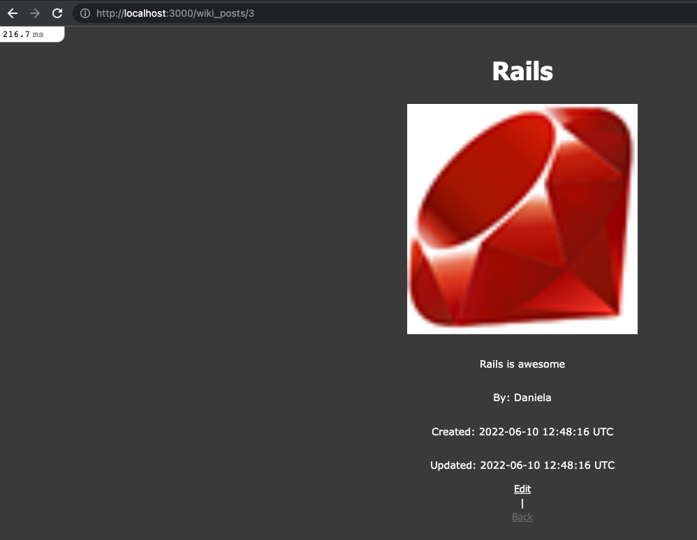

Generates markup html img tag:

```htm

```

Also notice in Rails console, all the activity to get image from ActiveStorage when the show view is loaded:

```
Started GET "/wiki_posts/3" for ::1 at 2022-06-11 07:43:49 -0400
Processing by WikiPostsController#show as HTML
  Parameters: {"id"=>"3"}
   (0.2ms)  SELECT sqlite_version(*)
  ↳ app/controllers/wiki_posts_controller.rb:66:in `set_wiki_post'
  WikiPost Load (1.9ms)  SELECT "wiki_posts".* FROM "wiki_posts" WHERE "wiki_posts"."id" = ? LIMIT ?  [["id", 3], ["LIMIT", 1]]
  ↳ app/controllers/wiki_posts_controller.rb:66:in `set_wiki_post'
  Rendering layout layouts/application.html.erb
  Rendering wiki_posts/show.html.erb within layouts/application
  ActiveStorage::Attachment Load (2.1ms)  SELECT "active_storage_attachments".* FROM "active_storage_attachments" WHERE "active_storage_attachments"."record_id" = ? AND "active_storage_attachments"."record_type" = ? AND "active_storage_attachments"."name" = ? LIMIT ?  [["record_id", 3], ["record_type", "WikiPost"], ["name", "image"], ["LIMIT", 1]]
  ↳ app/views/wiki_posts/show.html.erb:4
  ActiveStorage::Blob Load (0.5ms)  SELECT "active_storage_blobs".* FROM "active_storage_blobs" WHERE "active_storage_blobs"."id" = ? LIMIT ?  [["id", 1], ["LIMIT", 1]]
  ↳ app/views/wiki_posts/show.html.erb:4
  Rendered wiki_posts/show.html.erb within layouts/application (Duration: 52.2ms | Allocations: 2190)
[Webpacker] Everything's up-to-date. Nothing to do
  Rendered layout layouts/application.html.erb (Duration: 118.9ms | Allocations: 5916)
Completed 200 OK in 149ms (Views: 121.1ms | ActiveRecord: 5.8ms | Allocations: 7454)


Started GET "/rails/active_storage/blobs/redirect/eyJfcmFpbHMiOnsibWVzc2FnZSI6IkJBaHBCZz09IiwiZXhwIjpudWxsLCJwdXIiOiJibG9iX2lkIn19--14b57dc3f3c050c4cda945006c25874bb0579462/header-ruby-logo.png" for ::1 at 2022-06-11 07:43:50 -0400
Processing by ActiveStorage::Blobs::RedirectController#show as PNG
  Parameters: {"signed_id"=>"eyJfcmFpbHMiOnsibWVzc2FnZSI6IkJBaHBCZz09IiwiZXhwIjpudWxsLCJwdXIiOiJibG9iX2lkIn19--14b57dc3f3c050c4cda945006c25874bb0579462", "filename"=>"header-ruby-logo"}
  ActiveStorage::Blob Load (0.2ms)  SELECT "active_storage_blobs".* FROM "active_storage_blobs" WHERE "active_storage_blobs"."id" = ? LIMIT ?  [["id", 1], ["LIMIT", 1]]
  Disk Storage (1.6ms) Generated URL for file at key: 2zcagi3aaqffztmnulu6x6ur2hqu (http://localhost:3000/rails/active_storage/disk/eyJfcmFpbHMiOnsibWVzc2FnZSI6IkJBaDdDVG9JYTJWNVNTSWhNbnBqWVdkcE0yRmhjV1ptZW5SdGJuVnNkVFo0Tm5WeU1taHhkUVk2QmtWVU9oQmthWE53YjNOcGRHbHZia2tpVTJsdWJHbHVaVHNnWm1sc1pXNWhiV1U5SW1obFlXUmxjaTF5ZFdKNUxXeHZaMjh1Y0c1bklqc2dabWxzWlc1aGJXVXFQVlZVUmkwNEp5ZG9aV0ZrWlhJdGNuVmllUzFzYjJkdkxuQnVad1k3QmxRNkVXTnZiblJsYm5SZmRIbHdaVWtpRG1sdFlXZGxMM0J1WndZN0JsUTZFWE5sY25acFkyVmZibUZ0WlRvS2JHOWpZV3c9IiwiZXhwIjoiMjAyMi0wNi0xMVQxMTo0ODo1MC4yOTFaIiwicHVyIjoiYmxvYl9rZXkifX0=--0d367b229d4a3823ff02386f73733951618c713e/header-ruby-logo.png)
Redirected to http://localhost:3000/rails/active_storage/disk/eyJfcmFpbHMiOnsibWVzc2FnZSI6IkJBaDdDVG9JYTJWNVNTSWhNbnBqWVdkcE0yRmhjV1ptZW5SdGJuVnNkVFo0Tm5WeU1taHhkUVk2QmtWVU9oQmthWE53YjNOcGRHbHZia2tpVTJsdWJHbHVaVHNnWm1sc1pXNWhiV1U5SW1obFlXUmxjaTF5ZFdKNUxXeHZaMjh1Y0c1bklqc2dabWxzWlc1aGJXVXFQVlZVUmkwNEp5ZG9aV0ZrWlhJdGNuVmllUzFzYjJkdkxuQnVad1k3QmxRNkVXTnZiblJsYm5SZmRIbHdaVWtpRG1sdFlXZGxMM0J1WndZN0JsUTZFWE5sY25acFkyVmZibUZ0WlRvS2JHOWpZV3c9IiwiZXhwIjoiMjAyMi0wNi0xMVQxMTo0ODo1MC4yOTFaIiwicHVyIjoiYmxvYl9rZXkifX0=--0d367b229d4a3823ff02386f73733951618c713e/header-ruby-logo.png
Completed 302 Found in 10ms (ActiveRecord: 0.2ms | Allocations: 1420)


Started GET "/rails/active_storage/disk/eyJfcmFpbHMiOnsibWVzc2FnZSI6IkJBaDdDVG9JYTJWNVNTSWhNbnBqWVdkcE0yRmhjV1ptZW5SdGJuVnNkVFo0Tm5WeU1taHhkUVk2QmtWVU9oQmthWE53YjNOcGRHbHZia2tpVTJsdWJHbHVaVHNnWm1sc1pXNWhiV1U5SW1obFlXUmxjaTF5ZFdKNUxXeHZaMjh1Y0c1bklqc2dabWxzWlc1aGJXVXFQVlZVUmkwNEp5ZG9aV0ZrWlhJdGNuVmllUzFzYjJkdkxuQnVad1k3QmxRNkVXTnZiblJsYm5SZmRIbHdaVWtpRG1sdFlXZGxMM0J1WndZN0JsUTZFWE5sY25acFkyVmZibUZ0WlRvS2JHOWpZV3c9IiwiZXhwIjoiMjAyMi0wNi0xMVQxMTo0ODo1MC4yOTFaIiwicHVyIjoiYmxvYl9rZXkifX0=--0d367b229d4a3823ff02386f73733951618c713e/header-ruby-logo.png" for ::1 at 2022-06-11 07:43:50 -0400
Processing by ActiveStorage::DiskController#show as PNG
  Parameters: {"encoded_key"=>"[FILTERED]", "filename"=>"header-ruby-logo"}
Completed 200 OK in 1ms (ActiveRecord: 0.0ms | Allocations: 295)
```
### Migrating Databases

* Earlier when we ran migrations, notice we did NOT open a SQL console and type in SQL statements directly.
* Migrations define the process of modifying the database schema automatically rather than manually.
* Easily referenced using `migration` command, can be run the same way by developers, build script, dev, qa, prod, etc.
* Can also be rolled back

Example: Add a migration to limit the wiki post title length, otherwise user can enter in very long title that makes display look bad:

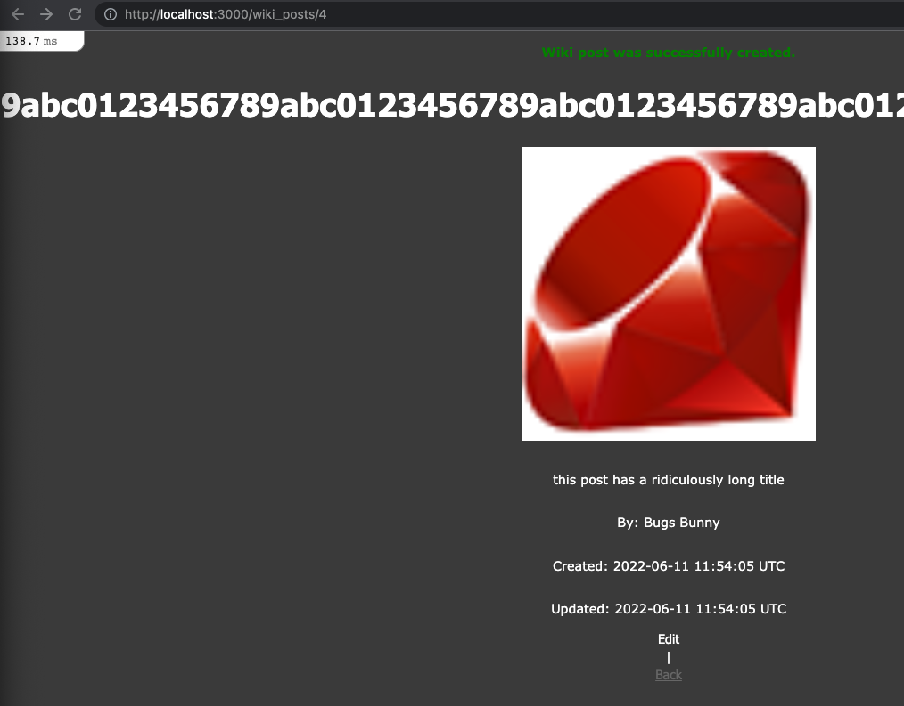

Start by generating a migration:

```
bin/rails g migration update_wiki_post_title
```

Output:

```
invoke  active_record
create    db/migrate/20220611115558_update_wiki_post_title.rb
```

Change the title column in wiki_posts table to have a max length of 50 characters:

```ruby
# wiki/db/migrate/20220611115558_update_wiki_post_title.rb
class UpdateWikiPostTitle < ActiveRecord::Migration[6.1]
  def change
    change_column :wiki_posts, :title, :string, :limit => 50
  end
end
```

Run migration with: `bin/rails db:migrate`, output:

```
== 20220611115558 UpdateWikiPostTitle: migrating ==============================
-- change_column(:wiki_posts, :title, :string, {:limit=>50})
   -> 0.0160s
== 20220611115558 UpdateWikiPostTitle: migrated (0.0161s) =====================
```

Note that this will only limit title length on *new* models created. Older ones that had longer title will remain in the database as is.

Actually, it still allows creation of any length title, limitation of SQLite used in course, according to `https://www.hwaci.com/sw/sqlite/faq.html`:

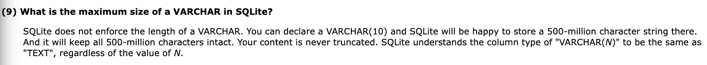

Suppose you don't want the character limit after all, this can be undone with `rollback`, can also specify how many migrations to rollback with `STEP`:

```
bin/rails db:rollback STEP=1
```

Output:

```
== 20220611115558 UpdateWikiPostTitle: reverting ==============================
rake aborted!
StandardError: An error has occurred, this and all later migrations canceled:


This migration uses change_column, which is not automatically reversible.
To make the migration reversible you can either:
1. Define #up and #down methods in place of the #change method.
2. Use the #reversible method to define reversible behavior.


/Users/dbaron/projects/pluralsight/rails-6-pluralsight/wiki/db/migrate/20220611115558_update_wiki_post_title.rb:3:in `change'
-e:1:in `<main>'

Caused by:
ActiveRecord::IrreversibleMigration:

This migration uses change_column, which is not automatically reversible.
To make the migration reversible you can either:
1. Define #up and #down methods in place of the #change method.
2. Use the #reversible method to define reversible behavior.


/Users/dbaron/projects/pluralsight/rails-6-pluralsight/wiki/db/migrate/20220611115558_update_wiki_post_title.rb:3:in `change'
-e:1:in `<main>'
Tasks: TOP => db:rollback
```

However, not all migrations can be automatically rolled back. For example, if a column is added, Rails can infer that rolling back means removing this column. But with this migration, the column definition was changed, and Rails doesn't know what the previous state of it was.

To fix this particular situation, need to define `up` and `down` methods in migration rather than using `change` that the generator had added:

```ruby
# wiki/db/migrate/20220611115558_update_wiki_post_title.rb
class UpdateWikiPostTitle < ActiveRecord::Migration[6.1]
  def up
    change_column :wiki_posts, :title, :string, :limit => 50
  end

  def down
    change_column :wiki_posts, :title, :string, :limit => 255
  end
end
```

Now try the rollback again:

```
bin/rails db:rollback STEP=1
```

This time it works:

```
== 20220611115558 UpdateWikiPostTitle: reverting ==============================
-- change_column(:wiki_posts, :title, :string, {:limit=>255})
   -> 0.0203s
== 20220611115558 UpdateWikiPostTitle: reverted (0.0204s) =====================
```

It's also possible to modify data in the migrations, eg: migrating from one format to another (and back the other way in case of rollback).

Rails keeps track of what migrations have been run or not using a `schema_migrations` table in the database, which is the first table Rails creates.

Check on status of migrations with status command:

```
bin/rails db:migrate:status
```

Output:

```
database: db/development.sqlite3

 Status   Migration ID    Migration Name
--------------------------------------------------
   up     20220604121631  Create wiki posts
   up     20220606103844  Add title to wiki posts
   up     20220610113424  Create active storage tablesactive storage
   up     20220610114400  Add author description to wiki post
  down    20220611115558  Update wiki post title
```

Let's "re-up" the migrations to apply length limit to wiki post title again:

```
bin/rails db:migrate
```

Output:

```
== 20220611115558 UpdateWikiPostTitle: migrating ==============================
-- change_column(:wiki_posts, :title, :string, {:limit=>50})
   -> 0.0281s
== 20220611115558 UpdateWikiPostTitle: migrated (0.0282s) =====================
```

And check status again with `bin/rails db:migrate:status`:

```
 Status   Migration ID    Migration Name
--------------------------------------------------
   up     20220604121631  Create wiki posts
   up     20220606103844  Add title to wiki posts
   up     20220610113424  Create active storage tablesactive storage
   up     20220610114400  Add author description to wiki post
   up     20220611115558  Update wiki post title
```

### Moving Data Between Views and Controllers

Flash messaging system and instance variables support moving data between controllers and can enhance Rails apps.

The create wiki post form has some logic for displaying error messages, this was generated from the `scaffold` command:

```erb
<!-- wiki/app/views/wiki_posts/_form.html.erb -->
<%= form_with(model: wiki_post) do |form| %>
  <% if wiki_post.errors.any? %>
    <div id="error_explanation">
      <h2><%= pluralize(wiki_post.errors.count, "error") %> prohibited this wiki_post from being saved:</h2>

      <ul>
        <% wiki_post.errors.each do |error| %>
          <li><%= error.full_message %></li>
        <% end %>
      </ul>
    </div>
  <% end %>

  <!-- form fields... -->
<% end %>
```

But what about success messages such as Wiki post created successfully? These come from `notice` object.

#### Flash System

* Rails can transfer information about a request through to the view.
* `Notice` is the default object used to create success messages.
* `Alert` is the default object used to create error messages.
* Custom names can be added using `flash.KeyName`.

Customize the `notice` message after a wiki post is successfully updated to show post title in the message. This message is set in the wiki posts controller:

```ruby
# wiki/app/controllers/wiki_posts_controller.rb
class WikiPostsController < ApplicationController
  before_action :set_wiki_post, only: %i[ edit update destroy show ]
  # ...
  # PATCH/PUT /wiki_posts/1 or /wiki_posts/1.json
  def update
    respond_to do |format|
      if @wiki_post.update(wiki_post_params)
        # Original notice message generated by scaffold
        # format.html { redirect_to wiki_post_url(@wiki_post), notice: "Wiki post was successfully updated." }

        # Updated message includes post title using string concatenation.
        # To maintain the quotes around the title, use escape backslash character to tell Ruby that the quote
        # is intended to literally be part of the string.
        format.html { redirect_to wiki_post_url(@wiki_post), notice: "You updated wiki post "+"\""+@wiki_post.title+"\"" }
        format.json { render :show, status: :ok, location: @wiki_post }
      else
        format.html { render :edit, status: :unprocessable_entity }
        format.json { render json: @wiki_post.errors, status: :unprocessable_entity }
      end
    end
  end
  # ...
end
```

To try this out, navigate to the show view for a particular post: `http://localhost:3000/wiki_posts/3` and click Edit, which goes to `http://localhost:3000/wiki_posts/3/edit`:

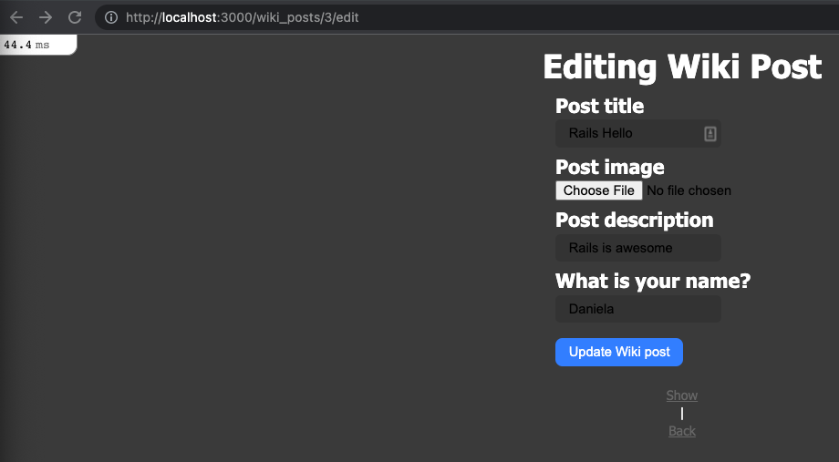

Then make any edit and click Update Wiki post button. Rails saves the change, and navigates to the show view `http://localhost:3000/wiki_posts/3` with the notice success message:

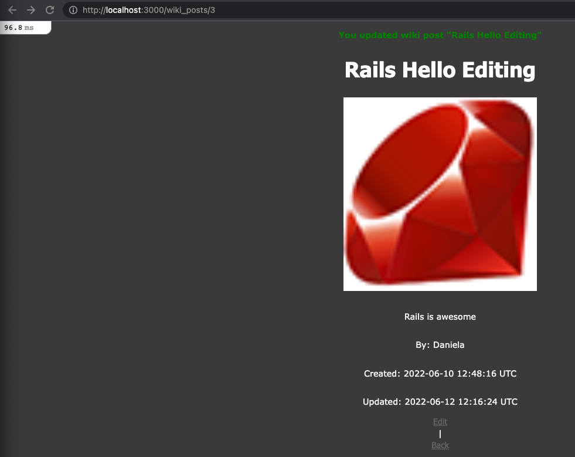

But how is this notice message included in the view? Looking at the show view, it contains a tag to render the notice, which was generated by the scaffold:

```erb
<!-- wiki/app/views/wiki_posts/show.html.erb -->
<p id="notice"><%= notice %></p>
...
```

The scaffold command also added this line at the beginning of the wiki posts index view `wiki/app/views/wiki_posts/index.html.erb`. It can be removed if not needed.

Notice the element with id of `notice` has some styles in `wiki/app/assets/stylesheets/scaffolds.scss` that were generated by the scaffold command. It can be customized.

#### Instance Variables

Use to pass info between controllers and views.

We've already been using model instance variables, for example, this line in wiki posts controller makes the `@wiki_post` model instance variable available to the view to display its properties:

```ruby
# wiki/app/controllers/wiki_posts_controller.rb
# ...
@wiki_post = WikiPost.find(params[:id])
# ...
```

Demonstrate another use of variables for controller <--> view communication. Define a `test` variable in `index` method of wiki posts controller and use `p` method (short for `puts`) to output it to Rails console, just to verify its set:

```ruby
# wiki/app/controllers/wiki_posts_controller.rb
class WikiPostsController < ApplicationController
  before_action :set_wiki_post, only: %i[ edit update destroy show ]
  # ...
  # GET /wiki_posts or /wiki_posts.json
  def index
    @wiki_posts = WikiPost.all
    test = "test"
    p test
  end
  # ...
end
```

Then navigate to wiki posts index view `http://localhost:3000/wiki_posts` and verify `"test"` is displayed in Rails console:

```
Started GET "/wiki_posts" for ::1 at 2022-06-12 08:30:50 -0400
Processing by WikiPostsController#index as HTML
"test"
  Rendering layout layouts/application.html.erb
  Rendering wiki_posts/index.html.erb within layouts/application
  Rendered wiki_posts/index.html.erb within layouts/application (Duration: 3.9ms | Allocations: 204)
[Webpacker] Everything's up-to-date. Nothing to do
  Rendered layout layouts/application.html.erb (Duration: 44.3ms | Allocations: 3927)
Completed 200 OK in 63ms (Views: 45.2ms | Allocations: 5372)
```

Now attempt to display the `test` variable in the wiki posts index view:

```erb
<!-- wiki/app/views/wiki_posts/index.html.erb -->
<p id="notice"><%= notice %></p>

<h1>Wiki Posts</h1>
<%= test %>

<%= link_to 'New Wiki Post', new_wiki_post_path %>
```

Refresh index view in browser to see change `http://localhost:3000/wiki_posts`, get error message `ArgumentError in WikiPosts#index` because view doesn't currently have access to the `test` variable, so it assumes it's a method and tries to invoke it but there is no such method defined:

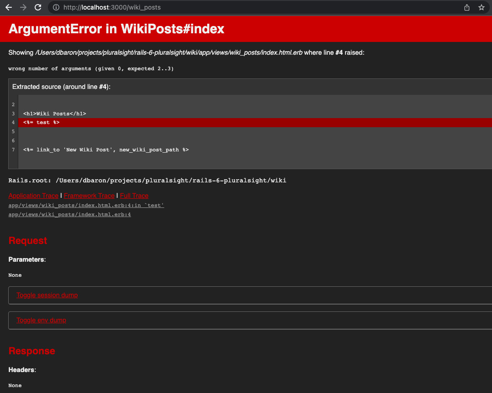

Note if try some other undefined variable such as `<%= foo %>` then get a different error `NameError in WikiPosts#index` for undefined local variable or method foo.

**Ruby Variables**

* Ruby supports local, global, instance, and class variables
* A Rails view is part of the same instance as the controller
* Instance variables defined within a controller are accessible in the corresponding view that the controller rendered.

To make the `test` variable accessible to the view, modify the controller `index` method to make it an instance variable using `@`:

```ruby
# wiki/app/controllers/wiki_posts_controller.rb
class WikiPostsController < ApplicationController
  before_action :set_wiki_post, only: %i[ edit update destroy show ]
  # ...
  # GET /wiki_posts or /wiki_posts.json
  def index
    @wiki_posts = WikiPost.all
    @test = "test"
    p @test
  end
  # ...
end
```

And modify corresponding view to use `@` when referencing the `test` variable:

```erb
<!-- wiki/app/views/wiki_posts/index.html.erb -->
<p id="notice"><%= notice %></p>

<h1>Wiki Posts</h1>
<%= @test %>

<%= link_to 'New Wiki Post', new_wiki_post_path %>
```

Now refresh index view `http://localhost:3000/wiki_posts` and can see `test` displayed:

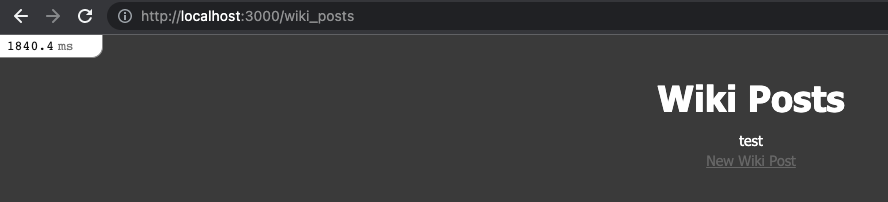

**Embedded Ruby**

* Embedded Ruby in erb templates only runs server-side -> actual variable never exposed to client. Only thing the client can see is what developer chooses to expose in view.
* Eg: sharing a specific user such as `@user1` can be rendered in a view without revealing the enter user object (which might include details such as role or password) to client -> good security
* Embedded logic and variables are only compiled on the server. Eg: could have a conditional in a view that shows limited data to guests and more data to admins, the compiled html sent to client will only contain data relevant to the intended user

### Finishing Touches

Copy view code that lists all posts from welcome index to wiki posts index. Need to change the instance variable from @posts to @wiki_posts because that's what the wiki posts controller names it:

```erb
<!-- wiki/app/views/wiki_posts/index.html.erb -->
<p id="notice"><%= notice %></p>

<h1>Wiki Posts</h1>

<% @wiki_posts.each do |post| %>
  <p>
    <h4><%= post.title %></h4>
    <%= link_to "View", wiki_post_path(post), class: 'wikiLink' %>
  </p>
<% end %>

<%= link_to 'New Wiki Post', new_wiki_post_path %>
```

#### Instance Methods

Add instance methods to model. Examples of use cases for this:
* Update relationship
* Add properties
* Define computed properties

Let's add method to WikiPost model `meta` to return formatted string containing author and timestamps of this post. Then it can be accessed from any instance of a post, such as any view code that displays it.

Start by just returning `author` from `meta` method:

```ruby
# wiki/app/models/wiki_post.rb
class WikiPost < ApplicationRecord
  has_one_attached :image

  def meta
    author
  end
end
```

Then update the show view, remove separate display of author, crreated_at, updated_at and replace with new meta method:

```erb
<!-- wiki/app/views/wiki_posts/show.html.erb -->
<p id="notice"><%= notice %></p>

<h1><%= @wiki_post.title %></h1>
<p><%= image_tag @wiki_post.image %></p>
<p><%= @wiki_post.description %></p>

<div>
  <%= @wiki_post.meta %>
</div>

<%= link_to 'Edit', edit_wiki_post_path(@wiki_post) %> |
<%= link_to 'Back', wiki_posts_path %>
```

Load a show view such as `http://localhost:3000/wiki_posts/5` to confirm author is displayed just above the Edit and Back links.

Update `meta` method using string concatenation to display other information about the post:

```ruby
# wiki/app/models/wiki_post.rb
class WikiPost < ApplicationRecord
  has_one_attached :image

  def meta
    "Created by #{author} on #{created_at} and last updated #{updated_at}."
  end
end
```

Refresh a post view `http://localhost:3000/wiki_posts/5` now looks like this:

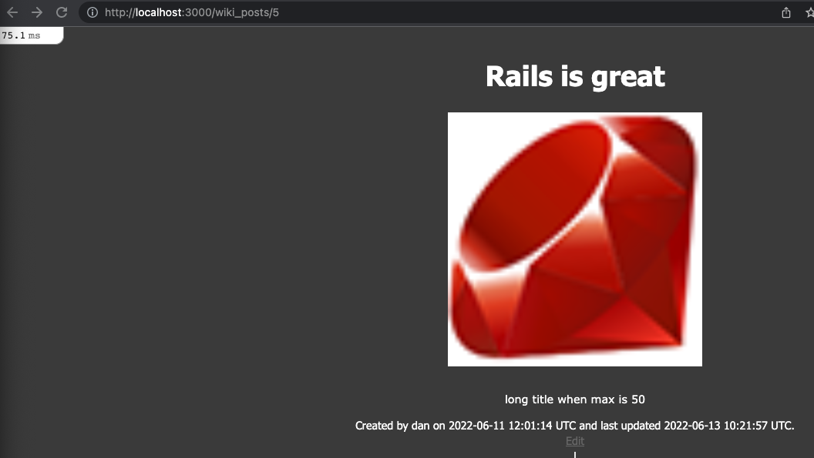

Notice the timestamps are displayed in UTC, eg: `2022-06-11 12:01:14 UTC`. Use Rails' [I18n.l](https://guides.rubyonrails.org/i18n.html) to localize timestamp to user's timezone.

```ruby
# wiki/app/models/wiki_post.rb
class WikiPost < ApplicationRecord
  has_one_attached :image

  def meta
    "Created by #{author} on #{I18n.l(created_at)} and last updated #{I18n.l(updated_at)}."
  end
end
```

For me it still displays in UTC but in a more human readable form:

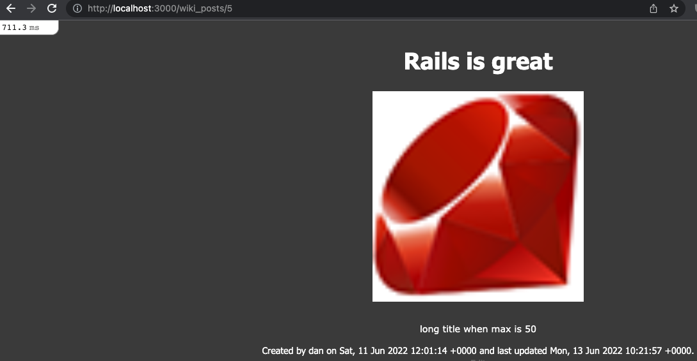

#### Date Format

Can also adjust the date format to `long`, otherwise, by default prints the time and timezone as well:

```ruby
# wiki/app/models/wiki_post.rb
class WikiPost < ApplicationRecord
  has_one_attached :image

  def meta
    "Created by #{author} on #{I18n.l(created_at, format: :long)} and last updated #{I18n.l(updated_at, format: :long)}."
  end
end
```

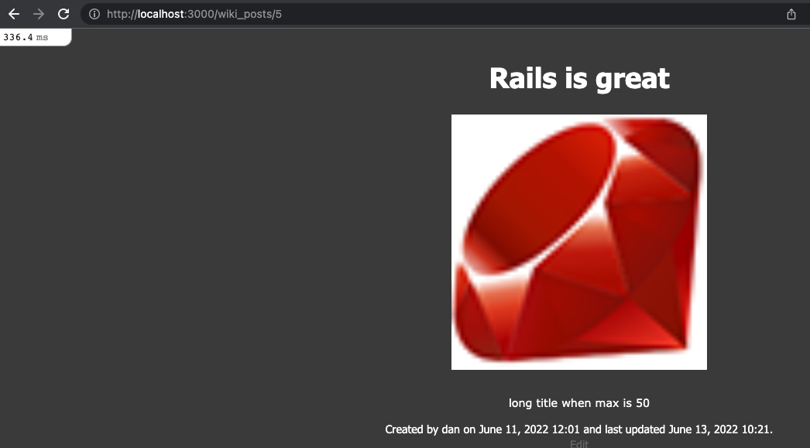

It's possible to request a custom format via url, eg: `http://localhost:3000/wiki_posts/5?locale=pirate`

#### Keeping Data in its Place

* Currently, the formatting of the data for display is being done in a model method, not ideal.
* Meta data is displayed and viewed through the View, not the Model.
* Logic related to formatting/viewing data should be moved out of the Model and into the View.
* Logic will go in a Partial

#### Partials

* Partials are roughly similar to components found in React, Vue, Angular etc.
* Partials support easy re-use of view logic

Partials are defined similarly to a view, but are prefixed with `_`. Create new erb file in wiki posts views folder. It will receive the wiki_post variable from when its rendered in the show view:

```erb
<!-- wiki/app/views/wiki_posts/_meta.html.erb -->
<div class="meta">
  Created by&nbsp;<strong><%= wiki_post.author %></strong>&nbsp;
  on&nbsp;<strong><%= wiki_post.created_at %></strong>&nbsp;
  and last updated&nbsp;<strong><%= wiki_post.updated_at %></strong>
</div>
```

Update show view, instead of invoking `@wiki_post.meta` model method, render the meta partial, passing in the instance of wiki_post model so the partial can have access to it to display its properties:

```erb
<!-- wiki/app/views/wiki_posts/show.html.erb -->
<p id="notice"><%= notice %></p>

<h1><%= @wiki_post.title %></h1>
<p><%= image_tag @wiki_post.image %></p>
<p><%= @wiki_post.description %></p>

<%= render 'meta', wiki_post: @wiki_post %>

<%= link_to 'Edit', edit_wiki_post_path(@wiki_post) %> |
<%= link_to 'Back', wiki_posts_path %>
```

Update `.meta... strong` styling in wiki posts scss:

```scss
// wiki/app/assets/stylesheets/wiki_posts.scss
.meta {
  display: flex;

  strong {
    display: inline-block;
    padding: 5px;
    border-radius: 3px;
    background-color: goldenrod;
  }
}
```

Refresh show view:

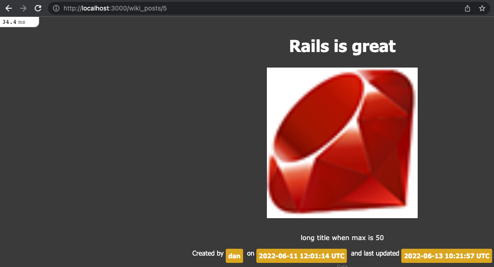

Left at 6:44 of Finishing Touches